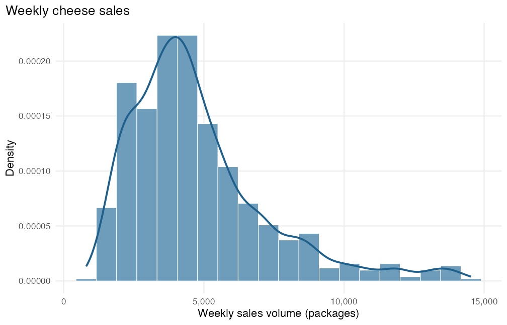
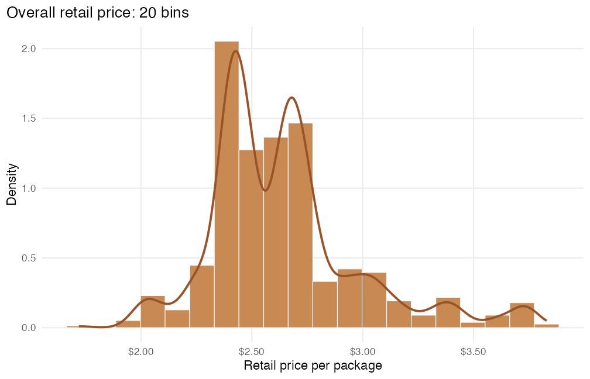
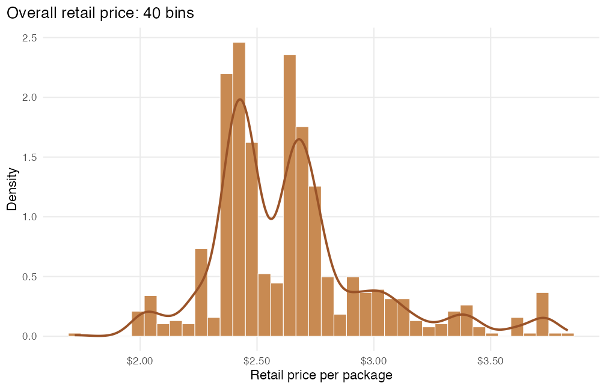
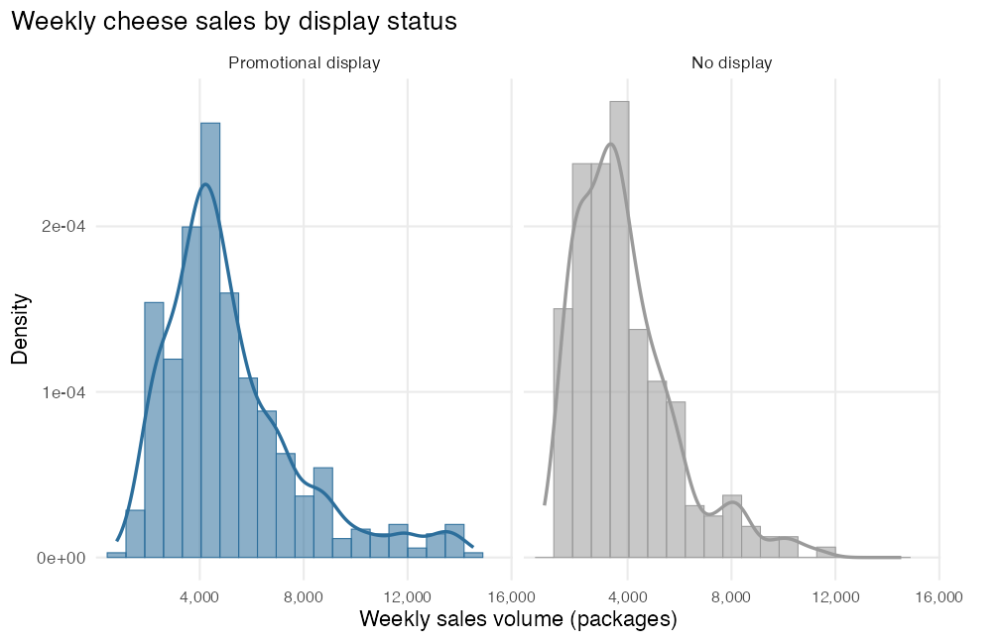
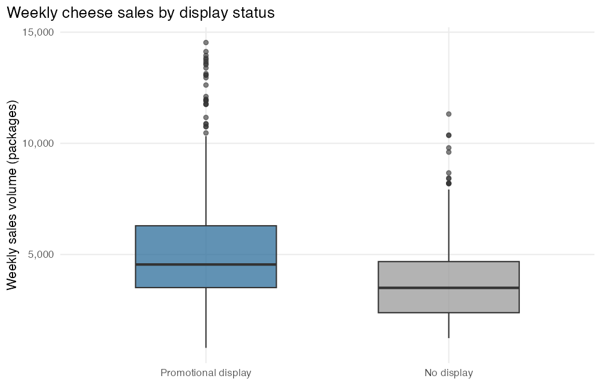
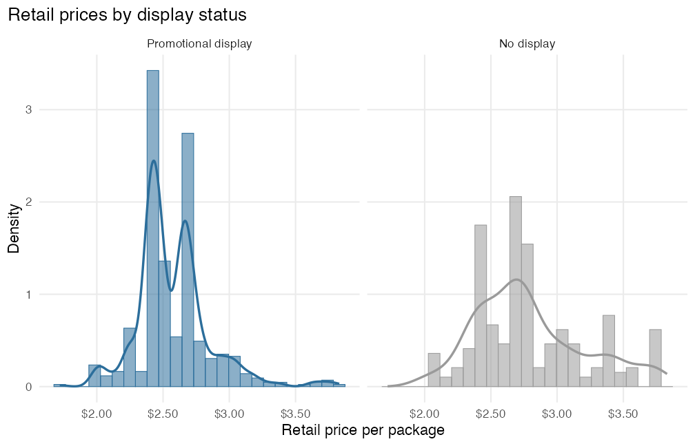
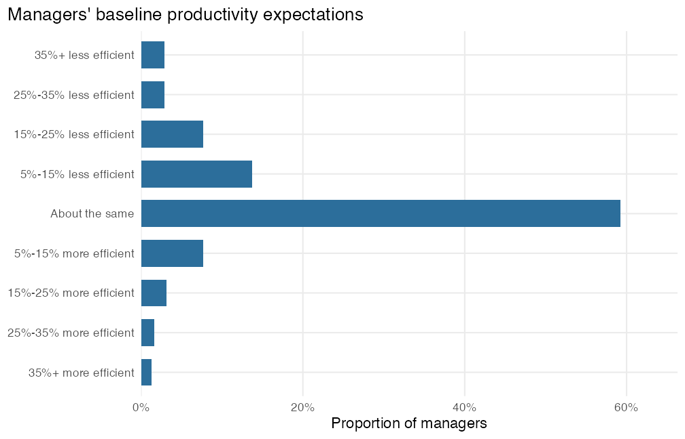

This example shows one complete way to generate the required Homework 1
output. It is a model, not a script you must follow word for word. The chat
creates tables and plots but does not answer or interpret the homework
questions.

::: {.conversation}

::: {.turn .student}
::: {.speaker}
Student
:::

Set up IntroStatGPT for Homework 1.
:::

::: {.turn .codex}
::: {.speaker}
IntroStatGPT
:::

Setup is complete. The assignment data and required R packages are ready.
:::

## Overall sales and price distributions

::: {.turn .student}
::: {.speaker}
Student
:::

Using all observations in the Kroger cheese data, make a histogram of `vol`
with density on the vertical axis and a density curve. Make the same kind of
histogram for `price`, with dollars on the horizontal axis. Then fork the price
histogram so I keep it and also have a version with roughly twice as many bins.
Give all three plots descriptive titles and clear axis labels.
:::

::: {.turn .codex}
::: {.speaker}
IntroStatGPT
:::

Created **P1: Overall weekly sales volume**.

::: {.artifact}

:::

Created **P2: Overall retail price**.

::: {.artifact}

:::

Forked P2 and created **P3: Overall retail price with narrower bins**. P2 is
still available.

::: {.artifact}

:::
:::

## Sales-volume distributions by display status

::: {.turn .student}
::: {.speaker}
Student
:::

Using the Kroger cheese data, make histograms of `vol` in separate panels for
observations with and without a promotional display. Put density on the
vertical axis, add a density curve, and use common horizontal and vertical
scales. Label the groups **Promotional display** and **No display** and give the
plot a descriptive title and clear axis labels.
:::

::: {.turn .codex}
::: {.speaker}
IntroStatGPT
:::

Created **P4: Weekly sales volume by display status**.

::: {.artifact}

:::
:::

## Sales-volume summaries by display status

::: {.turn .student}
::: {.speaker}
Student
:::

Using the Kroger cheese data, make one summary table for `vol` with rows for all
observations, promotional-display observations, and no-display observations.
Include the sample size, missing count, mean, standard deviation, 25th
percentile, median, 75th percentile, IQR, minimum, and maximum. Also make
side-by-side box plots for the two display groups on a common axis. Use the
labels **Promotional display** and **No display** and give both outputs clear
titles and labels.
:::

::: {.turn .codex}
::: {.speaker}
IntroStatGPT
:::

Created **T1: Weekly sales-volume summary by display status**.

| Group | Sample size | Missing | Mean | SD | Q1 | Median | Q3 | IQR | Minimum | Maximum |
| :--- | ---: | ---: | ---: | ---: | ---: | ---: | ---: | ---: | ---: | ---: |
| All observations | 706 | 0 | 4,771.5 | 2,485.0 | 3,128.5 | 4,255 | 5,737.5 | 2,609 | 799 | 14,534 |
| Promotional display | 485 | 0 | 5,182.7 | 2,603.2 | 3,510.0 | 4,549 | 6,292.0 | 2,782 | 799 | 14,534 |
| No display | 221 | 0 | 3,869.2 | 1,920.7 | 2,380.0 | 3,498 | 4,680.0 | 2,300 | 1,237 | 11,318 |

Created **P5: Weekly sales-volume box plots by display status**.

::: {.artifact}

:::
:::

## Price distributions by display status

::: {.turn .student}
::: {.speaker}
Student
:::

Using the Kroger cheese data, make a summary table for `price` with one row for
each display group. Include the sample size, missing count, mean, standard
deviation, 25th percentile, median, 75th percentile, IQR, minimum, and maximum,
and format prices in dollars. Also make price histograms in separate panels for
the two groups. Put density on the vertical axis, add a density curve, and use
common horizontal and vertical scales. Use the labels **Promotional display**
and **No display** and give both outputs clear titles and labels.
:::

::: {.turn .codex}
::: {.speaker}
IntroStatGPT
:::

Created **T2: Retail price summary by display status**.

| Group | Sample size | Missing | Mean | SD | Q1 | Median | Q3 | IQR | Minimum | Maximum |
| :--- | ---: | ---: | ---: | ---: | ---: | ---: | ---: | ---: | ---: | ---: |
| Promotional display | 485 | 0 | \$2.57 | \$0.28 | \$2.41 | \$2.50 | \$2.69 | \$0.28 | \$1.72 | \$3.83 |
| No display | 221 | 0 | \$2.79 | \$0.41 | \$2.47 | \$2.73 | \$3.03 | \$0.56 | \$2.03 | \$3.74 |

Created **P6: Retail price distributions by display status**.

::: {.artifact}

:::
:::

## Attrition variable summary

::: {.turn .student}
::: {.speaker}
Student
:::

Using the Bloom attrition data, summarize `treat` and `attrite_perc`. Report the
software type, number of missing values, and distinct observed values for each
variable.
:::

::: {.turn .codex}
::: {.speaker}
IntroStatGPT
:::

Created **T3: Attrition variable summary**.

| Variable | Software type | Missing | Distinct observed values |
| :--- | :--- | ---: | :--- |
| treat | character | 0 | Control; Treatment |
| attrite_perc | double | 0 | 0; 100 |
:::

## Employee attrition comparison

::: {.turn .student}
::: {.speaker}
Student
:::

Using the Bloom attrition data, make a table by treatment group with the group
sample size, Stayed and Left counts, and percentages within each group.
`attrite_perc` is 100 for an employee who left and 0 for an employee who stayed.
Use **Control** and **Hybrid WFH** for the treatment labels and **Stayed** and
**Left** for the outcome labels.
:::

::: {.turn .codex}
::: {.speaker}
IntroStatGPT
:::

Created **T4: Employee attrition comparison**.

| Group | Sample size | Stayed | Left | Stayed (%) | Left (%) |
| :--- | ---: | ---: | ---: | ---: | ---: |
| Control | 820 | 761 | 59 | 92.8% | 7.2% |
| Hybrid WFH | 792 | 754 | 38 | 95.2% | 4.8% |
:::

## Perceptions variable summary

::: {.turn .student}
::: {.speaker}
Student
:::

Using the Bloom perceptions data, summarize `wave`, `role`, and `productivity`.
Report the software type, number of missing values, and number of distinct
observed values for each variable.
:::

::: {.turn .codex}
::: {.speaker}
IntroStatGPT
:::

Created **T5: Perceptions variable summary**.

| Variable | Software type | Missing | Distinct observed values |
| :--- | :--- | ---: | ---: |
| wave | character | 0 | 2 |
| role | character | 0 | 2 |
| productivity | character | 0 | 9 |
:::

## Managers' perceptions table and plot

::: {.turn .student}
::: {.speaker}
Student
:::

Using the Bloom perceptions data, keep only managers at baseline. Make a table
with the count and proportion for every original `productivity` response and
confirm that it includes 314 managers. Keep the original labels in their
natural order from the strongest expected loss to the strongest expected gain,
not in frequency order. Also make a horizontal bar chart using proportions and
the same labels and order.
:::

::: {.turn .codex}
::: {.speaker}
IntroStatGPT
:::

Created **T6: Managers' baseline productivity perceptions**. The counts total
314 managers.

| Original response | Count | Proportion |
| :--- | ---: | ---: |
| 35%+ less efficient | 9 | 2.9% |
| 25%-35% less efficient | 9 | 2.9% |
| 15%-25% less efficient | 24 | 7.6% |
| 5%-15% less efficient | 43 | 13.7% |
| About the same | 186 | 59.2% |
| 5%-15% more efficient | 24 | 7.6% |
| 15%-25% more efficient | 10 | 3.2% |
| 25%-35% more efficient | 5 | 1.6% |
| 35%+ more efficient | 4 | 1.3% |

Created **P7: Managers' baseline productivity perceptions plot**.

::: {.artifact}

:::
:::

## Build the report skeleton

::: {.turn .student}
::: {.speaker}
Student
:::

Create a report called **Homework 1**. Put P1, P2, P3, P4, T1, P5, T2, and P6
under **Weekly cheese sales and promotional displays**. Put T3, T4, T5, T6,
and P7 under **Hybrid work, attrition, and productivity perceptions**. Keep
the outputs in the order I listed and show me the outline before you build it.
:::

::: {.turn .codex}
::: {.speaker}
IntroStatGPT
:::

Here is the proposed report outline.

**Weekly cheese sales and promotional displays:** P1, P2, P3, P4, T1, P5, T2,
P6

**Hybrid work, attrition, and productivity perceptions:** T3, T4, T5, T6, P7

Describe any changes, or approve this outline to build the Word report.
:::

::: {.turn .student}
::: {.speaker}
Student
:::

I approve this outline. Build the Word report.
:::

::: {.turn .codex}
::: {.speaker}
IntroStatGPT
:::

Built version 1 of the [Homework 1 report skeleton](../files/homework-01-report-skeleton.docx).
:::

:::

## What to do next

Open the Word skeleton, add your numbered answers near the output they use, and
export the completed document to PDF. The supplied skeleton is also available
as a backup if IntroStatGPT does not finish your report or as a check on output
you generated yourself.
