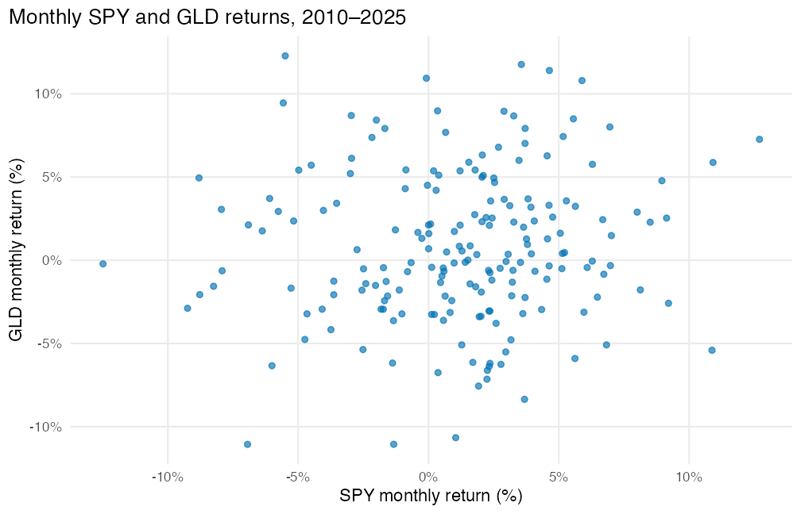
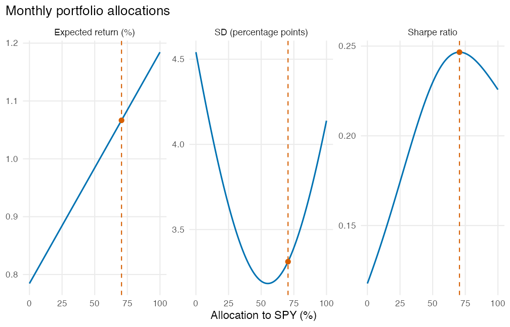

This example gives requests you can adapt for Homework 3. The tables and plots
were generated through the assignment harness; the conversation is assembled
to show one possible workflow. Output labels in your workspace may differ.

Do the hand calculations when the assignment asks for them, then request the
specified software checks. Add your own calculations, interpretations, and
recommendation to the report. For normal probabilities, first supply your
standardized value and the tail or tails; those requests will depend on your
work and are not included here.

::: {.conversation}

## Set up

::: {.turn .student}
::: {.speaker}
Student
:::

Set up this IntroStatGPT workspace and verify that it is ready. Do not begin an analysis yet.
:::

::: {.turn .codex}
::: {.speaker}
IntroStatGPT
:::

The workspace contains the assignment and four datasets: `portfolio_monthly_returns` (192 rows), `bloom_attrition` (1,612), `bloom_satisfaction` (1,346), and `bloom_performance` (1,507). Problems 2–4 supply their inputs in the questions.
:::

## 1.1. Return summaries

::: {.turn .student}
::: {.speaker}
Student
:::

Using `portfolio_monthly_returns`, report the observation count, mean, and
sample SD for SPY and GLD, using decimal returns and six decimal places. Also
report their correlation to six decimal places and covariance to eight decimal
places. Make a scatterplot of GLD return against SPY return for all months.
Label both axes with percentages. Save the two tables and plot for my report;
do not interpret them.
:::

::: {.turn .codex}
::: {.speaker}
IntroStatGPT
:::

Saved **T1: 1.1 Return summaries**.

| Asset | Months | Mean | SD |
| :--- | ---: | ---: | ---: |
| SPY | 192 | 0.011844 | 0.041391 |
| GLD | 192 | 0.007845 | 0.045416 |

:::

::: {.turn .codex}
::: {.speaker}
IntroStatGPT
:::

Saved **T2: 1.1 Correlation and covariance**.

| Quantity | Value |
| :--- | ---: |
| Correlation | 0.082948 |
| Covariance (decimal returns) | 0.00015593 |

:::

::: {.turn .codex}
::: {.speaker}
IntroStatGPT
:::

Saved **P1: 1.1 Monthly SPY and GLD returns**.



:::

## 1.2. Check the 60/40 portfolio

::: {.turn .student}
::: {.speaker}
Student
:::

For each month, calculate the return from 60% SPY and 40% GLD. Report the
observation count, mean, and sample SD of those monthly portfolio returns.
Calculate in decimals; show the mean and SD to six decimal places, with
percentages or percentage points in parentheses to two decimal places. Save
the table. I will compare it with my hand calculation.
:::

::: {.turn .codex}
::: {.speaker}
IntroStatGPT
:::

Saved **T3: 1.2 Direct 60/40 portfolio check**.

| Quantity | Value |
| :--- | ---: |
| Months | 192 |
| Mean monthly return | 0.010244 (1.02%) |
| Sample SD | 0.031963 (3.20 percentage points) |

:::

## 1.3. Compare allocations

::: {.turn .student}
::: {.speaker}
Student
:::

For portfolios with SPY weight from 0 to 1 and GLD weight equal to one minus
the SPY weight, use the full-period historical summaries and a fixed monthly
risk-free return of 0.0025. Find the maximum-Sharpe and minimum-SD allocations
over the full allowed range, checking the endpoints too. Report their weights,
expected monthly return, monthly SD, and Sharpe ratio, along with the same
quantities for 60/40. Calculate in decimals, then report weights as percentages
to one decimal place, returns as percentages and SDs in percentage points to
two decimal places, and Sharpe ratios to four decimal places.

Make a three-panel plot of expected return, SD, and Sharpe ratio against the
percentage invested in SPY. Mark the maximum-Sharpe allocation on all three
panels. Save the table and plot without interpretations.
:::

::: {.turn .codex}
::: {.speaker}
IntroStatGPT
:::

Saved **T4: 1.3 Portfolio allocations**.

| Allocation | SPY (%) | GLD (%) | Mean (%) | SD (pp) | Sharpe |
| :--- | ---: | ---: | ---: | ---: | ---: |
| Maximum Sharpe | 70.5 | 29.5 | 1.07 | 3.31 | 0.2466 |
| Minimum SD | 55.0 | 45.0 | 1.00 | 3.18 | 0.2371 |
| 60/40 | 60.0 | 40.0 | 1.02 | 3.20 | 0.2423 |

:::

::: {.turn .codex}
::: {.speaker}
IntroStatGPT
:::

Saved **P2: 1.3 Expected return SD and Sharpe ratio**.



:::

## 1.3c. Compare periods

::: {.turn .student}
::: {.speaker}
Student
:::

Repeat the return summaries, correlation, and covariance separately for
2010–2017 and 2018–2025. Use six decimal places for means, sample SDs, and
correlations, and eight for covariances. Find the maximum-Sharpe allocation
in each period using the same monthly risk-free return of 0.0025 and SPY
weights from 0 to 1. Report the allocations and portfolio summaries using
the rounding from the previous request. Save these three tables.
:::

::: {.turn .codex}
::: {.speaker}
IntroStatGPT
:::

Saved **T5: 1.3c Return summaries by period**.

| Period | Asset | Months | Mean | SD |
| :--- | ---: | ---: | ---: | ---: |
| 2010–2017 | SPY | 96 | 0.011430 | 0.034464 |
| 2010–2017 | GLD | 96 | 0.002698 | 0.049699 |
| 2018–2025 | SPY | 96 | 0.012258 | 0.047501 |
| 2018–2025 | GLD | 96 | 0.012992 | 0.040290 |

:::

::: {.turn .codex}
::: {.speaker}
IntroStatGPT
:::

Saved **T6: 1.3c Correlation and covariance by period**.

| Period | Correlation | Covariance |
| :--- | ---: | ---: |
| 2010–2017 | 0.026520 | 0.00004543 |
| 2018–2025 | 0.137823 | 0.00026376 |

:::

::: {.turn .codex}
::: {.speaker}
IntroStatGPT
:::

Saved **T7: 1.3c Maximum Sharpe allocations by period**.

| Period | SPY (%) | GLD (%) | Mean (%) | SD (pp) | Sharpe |
| :--- | ---: | ---: | ---: | ---: | ---: |
| 2010–2017 | 100.0 | 0.0 | 1.14 | 3.45 | 0.2591 |
| 2018–2025 | 38.3 | 61.7 | 1.27 | 3.28 | 0.3116 |

:::

## 4.1c. Check the mean test

::: {.turn .student}
::: {.speaker}
Student
:::

For the consumer survey, the sample size is 400, the sample mean is 0.034,
and the sample SD is 0.040, all in decimal units. Test a population mean of
0.040 against a two-sided alternative and give a 95% confidence interval.
Use these supplied summaries. Report the SE, test statistic, interval, and
p-value; show the p-value to five decimal places. Save the table. I will
compare it with my hand calculation using the 68/95/99.7% rule.
:::

::: {.turn .codex}
::: {.speaker}
IntroStatGPT
:::

Saved **T8: 4.1c Mean inflation expectations software check**.

| Quantity | Value |
| :--- | ---: |
| Sample size | 400 |
| Mean | 0.034 (3.4%) |
| Sample SD | 0.040 (4.0 percentage points) |
| SE | 0.002 (0.2 percentage points) |
| Null mean | 0.040 (4.0%) |
| t-statistic | -3.000 |
| 95% CI lower | 0.030068 (3.007%) |
| 95% CI upper | 0.037932 (3.793%) |
| Two-sided p-value | 0.00287 |

:::

## 5.1. Summarize the study

::: {.turn .student}
::: {.speaker}
Student
:::

Use the three Bloom datasets. For each assigned group, report its assigned
count, observed and missing counts for each outcome, the quit count and
proportion, and the satisfaction and performance means and sample SDs.
Use observed counts for each outcome; count a blank outcome as missing.
Report quit proportions to six decimal places with percentages to two in
parentheses, and score means and SDs to four decimal places. Save the table.
:::

::: {.turn .codex}
::: {.speaker}
IntroStatGPT
:::

Saved **T9: 5.1 Outcomes by assigned group**.

| Group | Outcome | Assigned | Observed | Missing | Mean or proportion | Sample SD |
| :--- | ---: | ---: | ---: | ---: | ---: | ---: |
| Hybrid | Quitting | 792 | 792 |   0 | 38/792 = 0.047980 (4.80%) | — |
| Hybrid | Satisfaction | 792 | 680 | 112 | 8.1853 | 1.4847 |
| Hybrid | Performance | 792 | 748 |  44 | 3.4385 | 0.8425 |
| Office | Quitting | 820 | 820 |   0 | 59/820 = 0.071951 (7.20%) | — |
| Office | Satisfaction | 820 | 665 | 155 | 7.8346 | 1.5962 |
| Office | Performance | 820 | 759 |  61 | 3.4941 | 0.8312 |

:::

## 5.3b. Compare means

::: {.turn .student}
::: {.speaker}
Student
:::

Estimate hybrid minus office mean performance and mean satisfaction.
For each, give a 95% confidence interval and test a zero difference against
a two-sided alternative, using employees with observed outcomes. Show
estimates and interval endpoints to three decimal places and p-values to
seven decimal places so the small satisfaction p-value remains visible.
Save the table without interpretations.
:::

::: {.turn .codex}
::: {.speaker}
IntroStatGPT
:::

Saved **T10: 5.3b Mean performance and satisfaction**.

| Outcome | Hybrid minus office | 95% CI | Two-sided p-value |
| :--- | ---: | ---: | ---: |
| Performance (points) | -0.056 | [-0.140, 0.029] | 0.1976812 |
| Satisfaction (points) | 0.351 | [0.186, 0.516] | 0.0000324 |

:::

## Build the report

::: {.turn .student}
::: {.speaker}
Student
:::

Arrange the saved tables and plots in assignment order. Keep headings for
1.1, 1.2, 1.3, Problem 2, Problem 3, 4.1, 4.2, 5.1, 5.2, 5.3, and 5.4,
including parts that have no saved output. Show me the proposed outline first.
I will add my hand calculations and written answers.
:::

::: {.turn .codex}
::: {.speaker}
IntroStatGPT
:::

Proposed outline:

```text
Homework 3 report skeleton

1.1. Return summaries
  - T1: 1.1 Return summaries [Table]
  - T2: 1.1 Correlation and covariance [Table]
  - P1: 1.1 Monthly SPY and GLD returns [Figure]

1.2. A 60/40 portfolio
  - T3: 1.2 Direct 60/40 portfolio check [Table]

1.3. Portfolio allocations
  - T4: 1.3 Portfolio allocations [Table]
  - P2: 1.3 Expected return SD and Sharpe ratio [Figure]
  - T5: 1.3c Return summaries by period [Table]
  - T6: 1.3c Correlation and covariance by period [Table]
  - T7: 1.3c Maximum Sharpe allocations by period [Table]

2. Lunch orders

3. Inspection workload

4.1. Inflation expectations
  - T8: 4.1c Mean inflation expectations software check [Table]

4.2. Family finances

5.1. Study design and summaries
  - T9: 5.1 Outcomes by assigned group [Table]

5.2. Quitting

5.3. Performance and satisfaction
  - T10: 5.3b Mean performance and satisfaction [Table]

5.4. Recommendation
```
:::

::: {.turn .student}
::: {.speaker}
Student
:::

Approve this outline. Build the Word report.
:::

::: {.turn .codex}
::: {.speaker}
IntroStatGPT
:::

The report is ready: [Homework 3 report skeleton](../files/homework-03-report-skeleton.docx).
:::

:::

Open the Word report and add your answers under the matching problem and part
numbers. Export your completed work to one or more PDFs, as described in the
assignment. The report skeleton contains output, not the written solutions.
