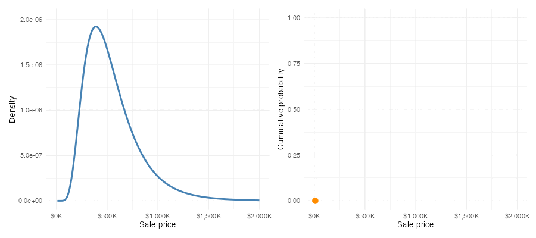

```{r}
#| label: setup
#| include: false
#| echo: false
library(tidyverse)
library(scales)
library(patchwork)

# Figures render at their intrinsic size (fig-width x 96px), capped by the
# ~702px content column -- they are never upscaled to fill it. So axis text
# lands at its true point size, and base_size, not fig-width, is what makes it
# legible next to 17px body text. At 13, tick labels are ~14px.
theme_set(theme_minimal(base_size = 13))

lending_subs <- read_csv("data/lending_club/data/df_subs.csv",
                         show_col_types = FALSE) |>
  mutate(default = as.integer(loan_status == "Charged Off"))

austin <- read_csv("data/austin_houses/austin_houses_subset.csv",
                   show_col_types = FALSE)

# CME FedWatch market-implied probabilities, retrieved 2026-07-09.
# Buckets are FOMC target ranges; midpoints used for numeric work.
cme_july <- tribble(
  ~bucket,        ~midpoint, ~prob,
  "3.50–3.75%", 3.625,  0.759,
  "3.75–4.00%", 3.875,  0.241
)

cme_sept <- tribble(
  ~bucket,        ~midpoint, ~prob,
  "3.50–3.75%", 3.625,  0.366,
  "3.75–4.00%", 3.875,  0.509,
  "4.00–4.25%", 4.125,  0.125
)
```

The introduction to our probability unit posed questions about data we don't have --- will a new loan default, where will the Fed's target range be after its next meeting. This chapter builds the machinery to do that carefully. We need three things: a way to talk about uncertain quantities (random variables), rules that any coherent assignment of chances must obey (probability), and a complete description of an uncertain quantity's possible values and their chances (a probability distribution).

## Random variables and events {#sec-random-variables}

::: {.Definition #defn-random-variable}
## Random variable

A **random variable** is a number about which we are uncertain, either because we have incomplete information or because it depends on what will happen in the future. We write random variables as capital letters ($X$, $Y$, $D$). Even when we don't know what value a random variable will take, we can always describe its range of possible outcomes.
:::

Our lending example gives two random variables right away. Let $D$ indicate whether a new small-business loan defaults: $D = 1$ if the borrower is eventually charged off and $D = 0$ if the loan is repaid. This is exactly the dummy-variable coding we used for historical loans back in the categorical-variables chapter, applied now to a loan whose fate is not yet known. Let $X$ be the payoff of that loan in dollars --- some amount if it's repaid, a smaller amount if it defaults. $D$ and $X$ are both random variables: numbers we will eventually observe but don't know today.

Not every uncertain quantity arrives as a number, and that's no obstacle. The Federal Reserve's target range after its July meeting is a category --- "3.50--3.75%" or "3.75--4.00%" --- but we can work with the range's midpoint when we need a number, just as we recoded whether a loan was charged off or paid in full to 1/0 (respectively) in @sec-dummy-variables.

An **event** is a collection of possible outcomes of one or more random variables. "The loan defaults" is an event ($D = 1$). So are "the payoff is at least \$10,000" ($X \geq 10{,}000$) and "the September target range ends up above 4%." Events are the things we assign probabilities to.

## Probability and its rules {#sec-prob-rules}

::: {.Definition #defn-probability}
## Probability

A **probability** is a number between zero and one attached to an event ---
the higher the number, the more likely the event.
:::

The previous chapter discussed what such numbers *mean*; whichever interpretation fits the application, the numbers must obey the same three rules.

::: {.callout-note}
## The three fundamental probability rules

1. **Probabilities are non-negative.** For any event $A$, $\Pr(A) \geq 0$.
2. **Something must happen.** $\Pr(\text{all possible outcomes}) = 1$.
3. **Probabilities of mutually exclusive events add.** If events $A$ and $B$ cannot both happen, then $\Pr(A \text{ or } B) = \Pr(A) + \Pr(B)$.
:::

Everything else we do with probabilities follows from these three rules. Three useful rules in particular are immediate consequences of these.

First, every probability lands between 0 and 1: an event with probability 1 is certain to happen, and an event with probability 0 is certain not to. Second, the **complement rule**: since "$A$ happens" and "$A$ doesn't happen" are mutually exclusive and together cover everything, Rules 2 and 3 force

$$
\Pr(\text{not } A) = 1 - \Pr(A).
$$

In words: the chance an event doesn't occur is one minus the chance it does. If a new small-business loan defaults with probability 0.25, it is repaid with probability 0.75; no separate calculation required. Third, when two events *can* overlap, adding their probabilities double-counts the overlap, and the general **addition rule** corrects for it:

$$
\Pr(A \text{ or } B) = \Pr(A) + \Pr(B) - \Pr(A \text{ and } B).
$$

In words: add the two chances, then subtract the chance of both happening at once, because that piece got counted twice.

The market-implied Fed forecasts we met last chapter obey these rules by construction. As of July 9, 2026, the CME FedWatch tool assigned probability `r number(cme_july$prob[1], accuracy = 0.001)` to the July target range being 3.50--3.75% and `r number(cme_july$prob[2], accuracy = 0.001)` to 3.75--4.00%. The two events are mutually exclusive --- the Fed sets one range --- and the market considers no other outcome possible, so the probabilities sum to `r number(sum(cme_july$prob), accuracy = 1)`.

## Discrete and continuous random variables {#sec-discrete-continuous}

Random variables come in two kinds.

::: {.Definition #defn-discrete-continuous}
## Discrete and continuous random variables

A **discrete random variable** can take only specific, distinct values: if you
can write its possible outcomes in a list, even a list that goes on forever, it
is discrete.

A **continuous random variable** can take any value in a range, so
between any two possible outcomes there is always another and no list can
capture them all.

The distinction matters because it changes how we describe a random
variable's distribution.
:::

Our default indicator $D$ (two possible values) and the loan payoff $X$ (two possible dollar amounts) are discrete. The sale price of a house and next week's return on the S&P 500 are naturally modeled as continuous.

In the language of observed data, continuous random variables are always quantitative. But not every quantitative variable is continuous: the number of loans in a portfolio that default is a *count* --- quantitative, but discrete, because its possible values (0, 1, 2, ...) form a list. Categorical variables, once coded as numbers the way we coded $D$, are always discrete.

::: {.TechnicalDetail #technical-continuous-abstraction}
## "Continuous" is an abstraction

Strictly speaking, many random variables we call continuous are not. A house
price is quoted to the penny, so its possible values technically form a (very
long) list. When the possible values are packed densely enough, treating the
variable as continuous is simpler and costs us nothing. Some variables
genuinely mix the two --- a household's annual medical spending can be
exactly zero, or any positive amount --- and we won't concern ourselves with
those here.
:::

## Probability distributions {#sec-prob-distributions}

::: {.Definition #defn-probability-distribution}
## Probability distribution

A **probability distribution** is a rule that assigns probabilities to all the
possible outcomes of a random variable, following the three rules of
@sec-prob-rules. It is the complete description of our uncertainty: not
just which outcomes can happen, but how likely each one is.
:::

For observed data we described distributions with frequency tables and density curves. Probability distributions are the same objects, built for data we don't have --- and they come in matching discrete and continuous forms.

### Discrete distributions

For a discrete random variable, the distribution can be written as a table: every possible outcome alongside its probability. The probabilities must be non-negative (Rule 1) and sum to one (Rules 2 and 3), exactly like the proportion column of a frequency table.

::: {.Definition #defn-pmf}
## Probability mass function

A **probability mass function (PMF)** assigns a probability to each possible outcome of a discrete random variable. The probabilities are non-negative and sum to one.
:::

Here is the distribution of our default indicator $D$, using a default probability of 0.25 --- a nice round number near the historical small-business rate of `r percent(mean(lending_subs$default[lending_subs$purpose == "small_business"]), accuracy = 0.1)`:

```{r}
#| label: tbl-default-pmf
#| tbl-cap: "Probability distribution of the default indicator $D$ for a new small-business loan."
#| echo: false
tribble(
  ~Outcome, ~`Meaning`, ~Probability,
  "$D = 1$", "Loan defaults", "0.25",
  "$D = 0$", "Loan is repaid", "0.75"
) |>
  knitr::kable(align = c("l", "l", "r"))
```

The payoff variable $X$ attaches dollar amounts to the same two outcomes. Suppose the loan is for \$10,000 at 12% interest, and that a defaulted loan recovers 60% of the principal --- numbers in the ballpark of our LendingClub data, rounded for clarity. Then $X$ is \$11,200 if the loan is repaid and \$6,000 if it defaults:

```{r}
#| label: tbl-payoff-pmf
#| tbl-cap: "Probability distribution of the loan payoff $X$: a \\$10,000 loan at 12% interest, with 60% of principal recovered in default."
#| echo: false
tribble(
  ~Outcome, ~`Meaning`, ~Probability,
  "$X = \\$11{,}200$", "Loan is repaid (principal + interest)", "0.75",
  "$X = \\$6{,}000$", "Loan defaults (60% of principal recovered)", "0.25"
) |>
  knitr::kable(align = c("l", "l", "r"))
```

Same two-outcome structure, same probabilities --- but because the outcomes are now dollar amounts, this table supports questions the 0/1 version couldn't. What payoff should the lender *expect*? How far might the realized payoff fall from that expectation? Those are questions about the center and spread of a probability distribution, and they get the next chapter to themselves.

The FedWatch forecasts are discrete distributions too, with more than two outcomes. @tbl-cme-margins shows the market-implied distributions for the next two FOMC meetings as of July 9, 2026. The possible outcomes are target *ranges*; for numeric work we will use each range's midpoint.

```{r}
#| label: tbl-cme-margins
#| tbl-cap: "Market-implied probability distributions for the FOMC target range after the July 29 and September 16, 2026 meetings (CME FedWatch, retrieved July 9, 2026). Midpoints stand in for the ranges in numeric calculations."
#| echo: false
full_join(
  cme_july |> rename(`July 29` = prob),
  cme_sept |> rename(`September 16` = prob),
  by = c("bucket", "midpoint")
) |>
  mutate(`July 29` = if_else(is.na(`July 29`), "---", number(`July 29`, accuracy = 0.001)),
         `September 16` = number(`September 16`, accuracy = 0.001),
         midpoint = percent(midpoint / 100, accuracy = 0.001)) |>
  rename(`Target range` = bucket, Midpoint = midpoint) |>
  knitr::kable(align = c("l", "r", "r", "r"))
```

```{r}
#| label: fig-cme-pmfs
#| fig-cap: "The same two distributions as bar charts. Each bar is one possible target range; heights are probabilities and sum to one within each panel. The September distribution spreads over three ranges because a second meeting adds a second chance for the range to move (the market prices essentially no chance of a cut, so no lower range is shown)."
#| fig-width: 8
#| fig-height: 3.6
p_july <- ggplot(cme_july, aes(x = bucket, y = prob)) +
  geom_col(fill = "steelblue", width = 0.6) +
  geom_text(aes(label = number(prob, accuracy = 0.001)), vjust = -0.5, size = 3.4) +
  scale_y_continuous(limits = c(0, 0.85),
                     expand = expansion(mult = c(0, 0.05))) +
  labs(x = NULL, y = "Probability", title = "July 29 meeting") +
  theme_minimal(base_size = 10)

p_sept <- ggplot(cme_sept, aes(x = bucket, y = prob)) +
  geom_col(fill = "steelblue", width = 0.6) +
  geom_text(aes(label = number(prob, accuracy = 0.001)), vjust = -0.5, size = 3.4) +
  scale_y_continuous(limits = c(0, 0.85),
                     expand = expansion(mult = c(0, 0.05))) +
  labs(x = NULL, y = NULL, title = "September 16 meeting") +
  theme_minimal(base_size = 10)

p_july | p_sept
```

Read the bars the way you read the bar charts of @sec-cat-viz, with one change of interpretation: heights are no longer shares of loans we counted, but chances for an outcome nobody has seen yet. 

### Continuous distributions

A continuous random variable has too many possible outcomes to list in a table, so its distribution takes a different form --- one we have already met. When we summarized observed prices and wages, the density curve told us where data were thick and where they were thin, and the area under the curve over any interval gave the proportion of observations falling in that interval. A continuous probability distribution is described by exactly such a curve.

::: {.Definition #defn-pdf}
## Probability density function

A **probability density function (PDF)** assigns probabilities to *intervals* of possible outcomes for a continuous random variable. The probability assigned to an interval is the area under the curve over that interval. The curve is never negative, and the total area beneath it is one.
:::

@fig-price-model-density shows a density curve for the sale price of a house that will come on the market in one of our three Austin ZIP codes. It's anchored on our observed data, but that's not important for now (we'll talk about how to fit probability models to data soon). The shaded region's area gives the probability that the sale price lands between \$400,000 and \$500,000.

```{r}
#| label: fig-price-model-density
#| fig-cap: "A probability density function for the sale price of a future home sale in the three-ZIP Austin subset. The shaded area is the probability that the sale price lands between $400,000 and $500,000."
#| fig-width: 7.5
#| fig-height: 4.5
m <- mean(austin$latest_price)
v <- var(austin$latest_price)
sdlog <- sqrt(log(1 + v / m^2))
mulog <- log(m) - log(1 + v / m^2) / 2

dens_df <- tibble(x = seq(1e4, 2e6, length.out = 800),
                  y = dlnorm(x, meanlog = mulog, sdlog = sdlog))
p_interval <- plnorm(5e5, mulog, sdlog) - plnorm(4e5, mulog, sdlog)

ggplot(dens_df, aes(x = x, y = y)) +
  geom_area(data = filter(dens_df, x >= 4e5, x <= 5e5),
            fill = "darkorange", alpha = 0.8) +
  geom_line(color = "steelblue", linewidth = 1) +
  annotate("label", x = 9.5e5, y = max(dens_df$y) * 0.55,
           label = paste0("area = ", number(p_interval, accuracy = 0.01),
                          "\nPr($400K < X < $500K)"),
           size = 3.6, fill = "white", alpha = 0.9, label.size = 0.25) +
  scale_x_continuous(labels = label_dollar(scale_cut = cut_short_scale()),
                     limits = c(0, 2e6)) +
  labs(x = "Sale price", y = "Density")
```

A probability density function is the same kind of object as the density curves of @sec-density-plots, now describing future data rather than observed data. Under this probability model, the probability that the sale price of any single future house in our three ZIP codes lands between \$400,000 and \$500,000 is `r number(p_interval, accuracy = 0.001)`. Under the frequency interpretation from last chapter: if each of the next 100 sales independently follows this same distribution, we'd expect to see about `r percent(p_interval, accuracy = 0.1)` of them selling for a price in that range.

::: {.callout-warning}
## Common mistake: The height of a density is not a probability

Only areas under a density curve are probabilities; a probability density function can take values greater than one. The curve's height at \$450{,}000 --- the middle of the shaded interval --- represents the relatively high probability of prices in a small interval around \$450{,}000, compared to the probability of seeing a price in an interval of the same width around \$150{,}000 or \$850{,}000 (for example).
:::

::: {.TechnicalDetail #technical-point-probability}
## Why $\Pr(X \leq x) = \Pr(X < x)$

For a continuous random variable the two events differ by exactly one value,
$x$, and the region over a single point is a vertical line from $x$ up to the
density curve. A line has no area, so

$$
\Pr(X = x) = 0
$$

for every $x$, and the two inequalities carry the same probability. This is an abstract mathematical consequence of using an idealized continuous probability distribution; for practical purposes it just means we don't have to worry about $\leq$ versus $<$ (or $\geq$ versus $>$) when we do probability calculations with continuous random variables.
:::

::: {.Definition #defn-cumulative-distribution-function}
## Cumulative distribution function

The **cumulative distribution function (CDF)** of a random variable gives
$\Pr(X \leq x)$ --- the probability accumulated up to the threshold $x$ --- for
every possible threshold $x$. It starts at 0 on the far left and rises to 1 on the
far right. Every random variable has a CDF, whether it is discrete,
continuous, or a mixture of the two, while a density function exists only for
continuous variables. For a discrete random variable the CDF is a step function
that jumps at each possible outcome, and the height of the jump is that
outcome's probability.
:::

Plotting the accumulated area under the density against the threshold $x$ traces the CDF, the model analogue of the empirical CDF we drew for observed prices in the first chapter. The relationship runs both ways: the density at $x$ is the rate at which cumulative probability accumulates as the threshold passes $x$ (if you've had calculus: the PDF is the derivative of the CDF). @fig-price-model-cdf shows the pair for a single threshold (\$500K) and probability.

```{r}
#| label: fig-price-model-cdf
#| fig-cap: "Left: the model density with the area below $500,000 shaded. Right: the model's cumulative distribution function, tracing that accumulated area as the threshold moves. The marked point on the right equals the shaded area on the left."
#| fig-width: 9
#| fig-height: 4
x0 <- 5e5
p_below <- plnorm(x0, mulog, sdlog)

cdf_df <- tibble(x = dens_df$x, cdf = plnorm(x, mulog, sdlog))

p_dens <- ggplot(dens_df, aes(x = x, y = y)) +
  geom_area(data = filter(dens_df, x <= x0),
            fill = "darkorange", alpha = 0.8) +
  geom_line(color = "steelblue", linewidth = 1) +
  annotate("label", x = 1.05e6, y = max(dens_df$y) * 0.6,
           label = paste0("area = ", number(p_below, accuracy = 0.01)),
           size = 3.6, fill = "white", alpha = 0.9, label.size = 0.25) +
  scale_x_continuous(labels = label_dollar(scale_cut = cut_short_scale()),
                     limits = c(0, 2e6)) +
  labs(x = "Sale price", y = "Density") +
  theme_minimal(base_size = 10)

p_cdf <- ggplot(cdf_df, aes(x = x, y = cdf)) +
  geom_line(color = "steelblue", linewidth = 1) +
  annotate("point", x = x0, y = p_below, color = "darkorange", size = 3) +
  annotate("label", x = x0, y = p_below, parse = TRUE,
           label = paste0('Pr(X <= "$500K") == ', number(p_below, accuracy = 0.01)),
           hjust = -0.08, vjust = 1, size = 3.6,
           fill = "white", alpha = 0.9, label.size = 0.25) +
  scale_x_continuous(labels = label_dollar(scale_cut = cut_short_scale()),
                     limits = c(0, 2e6)) +
  scale_y_continuous(limits = c(0, 1)) +
  labs(x = "Sale price", y = "Cumulative probability") +
  theme_minimal(base_size = 10)

p_dens | p_cdf
```

Varying the threshold traces out the CDF:

{#fig-cdf-animation}

Just as we boiled a column of data down to a mean and a standard deviation, we can boil a probability distribution down to a few numbers that locate its center and measure its spread. Those numbers are among the distribution's **parameters** --- features of a probability distribution, of which center and spread are the first two we'll study --- and they are where the next chapter begins.

## Data used in this section {.unnumbered}

- [Austin House Listings](appendix_data.qmd#sec-data-housing-kaggle)
- [LendingClub Accepted Loans](appendix_data.qmd#sec-data-lendingclub-kaggle)
