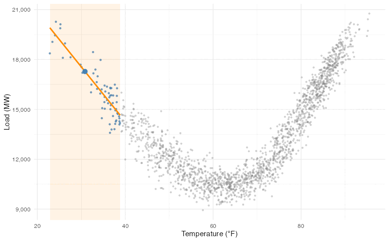

```{r}
#| label: setup
#| include: false
#| echo: false
library(tidyverse)
library(scales)
library(patchwork)

# Figures render at their intrinsic size (fig-width x 96px), capped by the
# ~702px content column -- they are never upscaled to fill it. So axis text
# lands at its true point size, and base_size, not fig-width, is what makes it
# legible next to 17px body text. At 13, tick labels are ~14px.
theme_set(theme_minimal(base_size = 13))

austin <- read_csv("data/austin_houses/austin_houses_subset.csv",
                   show_col_types = FALSE)

mincer <- read_csv("data/mincer/cps_asec_2023.csv",
                   show_col_types = FALSE)

returns <- read_csv("data/returns/returns.csv", show_col_types = FALSE) |>
  mutate(date = as.Date(date))

load1 <- read_csv("data/ercot/ercotproject/Data/load_1.csv",
                  show_col_types = FALSE)
load2 <- read_csv("data/ercot/ercotproject/Data/load_2.csv",
                  show_col_types = FALSE)
load3 <- read_csv("data/ercot/ercotproject/Data/load_3.csv",
                  show_col_types = FALSE)
ercot <- bind_rows(load1, load2, load3) |>
  filter(LOCATION == "North Central (DFW)") |>
  mutate(datetime = parse_date_time(DATEHOUR, orders = c("ymd HM", "ymd HMS")),
         year = year(datetime),
         date = as.Date(datetime)) |>
  filter(year >= 2016, year <= 2020) |>
  summarize(LOAD = mean(LOAD, na.rm = TRUE),
            date = first(date),
            .by = c(datetime, LOCATION))
rm(load1, load2, load3)

weather <- read_csv("data/ercot/ercotproject/Data/weather_ncent.csv",
                    show_col_types = FALSE) |>
  mutate(datetime = parse_date_time(DATEHOUR, orders = c("ymd HM", "ymd HMS")),
         year = year(datetime)) |>
  filter(year >= 2016, year <= 2020) |>
  summarize(HourlyDryBulbTemperature = mean(HourlyDryBulbTemperature, na.rm = TRUE),
            .by = c(datetime, LOCATION))

ercot_temp <- ercot |>
  inner_join(weather, by = c("datetime", "LOCATION")) |>
  filter(!is.na(HourlyDryBulbTemperature), !is.na(LOAD))

ercot_daily <- ercot_temp |>
  summarize(temp = mean(HourlyDryBulbTemperature, na.rm = TRUE),
            load = mean(LOAD, na.rm = TRUE),
            .by = date)
rm(weather)
```

Up to now you've seen probability for multiple categorical variables; in this section we extend those ideas to quantitative variables, including those modeled as continuous random variables. 
The joint and conditional distributions from [Chapter 10](prob_05_multivariate-distributions.qmd) and independence from [Chapter 12](prob_07_independence.qmd#sec-independence) have natural analogues for continuous random variables. Their formulas involve more complicated mathematics, so here we focus primarily on visual descriptions and building intuition. We follow the trajectory of [Chapter 10](prob_05_multivariate-distributions.qmd#sec-joint-marginal-conditional-proportions): describing the observed joint distribution of two variables in data, and then introducing related probability concepts. We begin with the *scatterplot*.

## Scatterplots {#sec-scatterplots}

A **scatterplot** puts one variable on each axis and draws a point for every observation.  @fig-austin-price-sqft plots `r comma(nrow(austin))` Austin home sales from three ZIP codes (78721, 78723, and 78731), the same homes whose ages we plotted in [Chapter 2](singlevar_02_describing-distributions.qmd#fig-austin-bimodal), with living area on the x-axis and sale price on the y-axis.

```{r}
#| label: fig-austin-price-sqft
#| fig-cap: "Sale price versus living area for Austin homes in three ZIP codes. Each point is one home. Prices tend to rise with size, but homes of the same size sell for a wide range of prices."
#| fig-width: 7
#| fig-height: 5
ggplot(austin, aes(x = living_area_sq_ft, y = latest_price)) +
  geom_point(alpha = 0.3, color = "steelblue") +
  scale_x_continuous(labels = comma_format()) +
  scale_y_continuous(labels = dollar_format(scale = 1e-3, suffix = "K")) +
  labs(x = "Living area (sq ft)", y = "Sale price")
```

A scatterplot gives us a quick visual description of how the two variables tend to move *together*. Here we see a positive relationship --- larger houses tend to sell for more --- that is close to *linear*. A straight line describes the broad pattern reasonably well. We see some evidence that the variability in prices is larger for bigger houses --- the range of prices for houses around 1,000 sqft is narrower than the range of prices for houses around 3,000 sqft, for example. 

When the sample size is large a scatterplot can turn into an unreadable blob. Even when the sample size is small, if one or both variables have many ties it can be difficult to read the scatterplot. For example, the CPS data from [Chapter 2](singlevar_02_describing-distributions.qmd#sec-symmetric-skewed) has both problems. The sample size is large (`r comma(nrow(mincer))` workers) and one of the key variables --- years of education, `educ_years` --- takes only a handful of distinct values.  A naive scatterplot (@fig-mincer-wage-educ, left panel) piles tens of thousands of workers onto a few vertical lines. 

```{r}
#| label: fig-mincer-wage-educ
#| fig-cap: "Hourly wage versus years of education for full-time U.S. workers (2023 CPS; wages under $150/hr shown). Left: the raw scatterplot stacks thousands of workers onto a few vertical lines. Middle: jitter spreads the ties apart, but the strips stay solid. Right: adding transparency, so that darker regions hold more workers, makes the plot readable."
#| fig-width: 10
#| fig-height: 4
set.seed(20260908)
mincer_sub <- mincer |> filter(hrly_wage <= 150)

mincer_panel <- function(geom_layer, title, show_y_title = FALSE) {
  ggplot(mincer_sub, aes(x = educ_years, y = hrly_wage)) +
    geom_layer +
    scale_y_continuous(labels = dollar_format()) +
    labs(x = "Years of education",
         y = if (show_y_title) "Hourly wage" else NULL,
         title = title) +
    theme_minimal(base_size = 10)
}

p1 <- mincer_panel(
  geom_point(alpha = 1, size = 0.8, color = "steelblue"),
  "Raw", show_y_title = TRUE
)

p2 <- mincer_panel(
  geom_jitter(width = 0.2, height = 0, size = 0.8, alpha = 1, color = "steelblue"),
  "Jittered"
)

p3 <- mincer_panel(
  geom_jitter(width = 0.2, height = 0, size = 0.8, alpha = 0.05, color = "steelblue"),
  "Jittered + transparency"
)

p1 | p2 | p3
```

To fix the ties we can apply **jitter**, which adds a little random horizontal shake to the reported years of education so identical x-values spread apart (@fig-mincer-wage-educ, middle panel). Even then we see wider but mostly dark strips. The right panel of @fig-mincer-wage-educ adds **transparency**, so densely-packed areas appear darker than less-dense areas. (@fig-austin-price-sqft also uses a little transparency if you look closely.)

Another viable option is to treat years of education as an ordinal categorical variable when we create our plots. Either approach works; the best option depends on the purpose of the visualization and the audience.

Wages tend to increase with years of education. The spread of wages seems to increase with education as well.


## Smooth curves {#sec-nonlinear}

Electricity demand is high on both hot and cold days, when households and
businesses use more cooling or heating. The ERCOT data below pair daily average
electricity demand with daily average temperature in the Dallas–Fort Worth
region from 2016 through 2020. Each point represents one day. To help visualize the trend in load ($Y$) as the temperature ($X$) increases, we can add a **smoother**, a curve that passes through the "middle" of the observed loads at nearby temperatures. This can be a useful visual guide, especially when the sample size is large and the data exhibit a lot of variability. Here are the ERCOT data with a smoother overlaid:

```{r}
#| label: fig-ercot-load-temp
#| fig-cap: "Daily average electricity demand versus daily average temperature in the DFW region. The curve summarizes how average demand varies with temperature."
#| fig-width: 7
#| fig-height: 5
# Windowed running-line smoother. Keep h and the grid IDENTICAL to
# working/loess_animation.R, which animates this exact construction.
h <- 8
x_grid <- seq(min(ercot_daily$temp) + h, max(ercot_daily$temp) - h, length.out = 80)

local_fit <- function(x0) {
  window <- filter(ercot_daily, abs(temp - x0) <= h)
  fit <- lm(load ~ temp, data = window)
  predict(fit, newdata = tibble(temp = x0))
}
smooth_df <- tibble(temp = x_grid, load = map_dbl(x_grid, local_fit))
load_at_50 <- unname(local_fit(50))

ggplot(ercot_daily, aes(x = temp, y = load)) +
  geom_point(alpha = 0.3, size = 0.8, color = "grey50") +
  geom_line(data = smooth_df, color = "steelblue", linewidth = 1.1) +
  scale_y_continuous(labels = comma_format()) +
  labs(x = expression("Temperature ("*degree*"F)"), y = "Load (MW)")
```
As expected the curve bends upward at both ends: demand is lower on mild days and higher
at temperature extremes. You can think about the curve as representing the *average* load
across all days where the temperature takes a specific value. For example, the curve passes through
about `r comma(round(load_at_50, -3))` MW at 50°F. That is, according to the smooth
summary, if we observe load on many 50°F days, the average load would be about
`r comma(round(load_at_50, -3))` MW. The spread of the points around the curve
near 50°F depicts how difficult it is to predict load for an individual 50°F day.
These are *conditional* location and spread: given that it is 50°F outside,
what is our best guess for load, and how wrong are we likely to be?

::: {.TechnicalDetail #technical-smoother-construction}
## Constructing a smooth curve

The curve above uses a moving temperature window. Within each window we fit a
straight line to demand and temperature, then use its height at the window's
center as one point on the curve. Moving the window and connecting those
heights produces the curve. A wider window averages over more of the data; a
narrower window follows local variation more closely.

{#fig-loess-anim}
:::

The Austin housing data have more scatter around their trend. Below are the
same homes with a smooth curve estimating average price from nearby homes.

```{r}
#| label: fig-austin-price-sqft-smooth
#| fig-cap: "A smooth curve for the Austin homes. Prices increase with size, with considerable house-to-house variation around the curve."
#| fig-width: 7
#| fig-height: 5
ggplot(austin, aes(x = living_area_sq_ft, y = latest_price)) +
  geom_point(alpha = 0.25, color = "grey50") +
  geom_smooth(method = "loess", span = 0.75, se = FALSE,
              color = "steelblue", linewidth = 1) +
  scale_x_continuous(labels = comma_format()) +
  scale_y_continuous(labels = dollar_format(scale = 1e-3, suffix = "K")) +
  labs(x = "Living area (sq ft)", y = "Sale price")
```

The curve bends gently, but small bends need not reflect a stable relationship
in the population. We should be particularly cautious among the larger homes,
where fewer observations determine the curve. A smoother can help us see a
relationship without requiring it to be linear; it will generally not be
perfectly straight even when the underlying relationship is linear.

## Linear Relationships and Correlation {#sec-cov-cor}

The Austin scatterplot has a roughly straight upward pattern; the ERCOT plot
has a pronounced curve. 
What is a *linear* relationship? We will make it precise in later chapters, but the idea is simple: the relationship is linear if
the smooth curve we would draw through the middle of the points would be a straight line.

For example, the weekly asset returns introduced in [Chapter 2](singlevar_02_describing-distributions.qmd#sec-symmetric-skewed)
include Tesla and the S&P 500 market index. The scatterplot below pairs their
returns for `r nrow(returns)` weeks, from `r format(min(returns$date), '%B %Y')`
through `r format(max(returns$date), '%B %Y')`. Each point represents one week.

```{r}
#| label: fig-tsla-market
#| fig-cap: "Tesla and S&P 500 weekly returns. The broad pattern is upward and roughly linear, with considerable variation in Tesla returns for similar market returns."
#| fig-width: 7
#| fig-height: 5
ggplot(returns, aes(x = market, y = TSLA)) +
  geom_point(alpha = 0.7, color = "steelblue") +
  geom_hline(yintercept = 0, linetype = "dashed", color = "grey60") +
  geom_vline(xintercept = 0, linetype = "dashed", color = "grey60") +
  scale_x_continuous(labels = percent_format(accuracy = 1)) +
  scale_y_continuous(labels = percent_format(accuracy = 1)) +
  labs(x = "S&P 500 weekly return", y = "Tesla weekly return")
```

When is a relationship *non*linear? When it cannot be described well by a straight line; the ERCOT data above are a classic example of a nonlinear relationship.

**Correlation** summarizes the direction and strength
of a *linear* relationship. It is useful as a one-number summary of how two variables tend to move together, **provided they have a linear relationship**. It is also useful because, together with their standard deviations, it tells us what happens to the spread when we create a linear combination of two variables, like when we build an investment portfolio or turn forecasted revenue and costs into profit, even if the original random variables have a nonlinear relationship. We will come back to this in [Chapter 14](prob_09_combining-random-variables.qmd#sec-lincom-rules).


::: {.Definition #defn-correlation}
## Correlation

The sample **correlation**, written $r$, ranges from $-1$ to $1$.

- Positive correlation describes an upward linear association; negative
  correlation describes a downward linear association.
- A correlation of $1$ or $-1$ means all points lie on a straight line, sloping
  upward or downward respectively.
- Values nearer $1$ or $-1$ indicate stronger linear association. A correlation
  of zero means no linear association.

Correlation has no units. Changing square feet to square meters, for example,
does not change the correlation between house size and price. Both variables
must vary for their correlation to be defined.
:::

The simulated scatterplots below show different strengths and directions of
linear association. Each panel contains 500 observations from a probability
model with the labelled **population correlation**. These labels describe
the generating models; the sample correlations $r$ fluctuate around them.

```{r}
#| label: fig-corr-panels
#| fig-cap: "Samples of 500 observations from models with the labelled population correlations. Zero is in the center; at either extreme all points lie on a straight line."
#| fig-width: 7
#| fig-height: 7
set.seed(42)
rs <- c(1, 0.75, 0.5, 0.25, 0, -0.25, -0.5, -0.75, -1)
n <- 500

corr_panels <- map_dfr(rs, function(r) {
  x <- rnorm(n)
  y <- r * x + sqrt(1 - r^2) * rnorm(n)
  tibble(x = x, y = y, panel = match(r, rs),
         label = paste0("Population correlation\n", number(r, accuracy = 0.01)))
}) |>
  mutate(label = factor(label, levels = unique(label)))

ggplot(corr_panels, aes(x = x, y = y)) +
  geom_point(size = 0.4, alpha = 0.4, color = "steelblue") +
  facet_wrap(~label, ncol = 3) +
  coord_equal() +
  theme_minimal(base_size = 12) +
  theme(axis.text = element_blank(), axis.ticks = element_blank(),
        panel.grid = element_blank()) +
  labs(x = NULL, y = NULL)
```
For the Austin homes, the correlation between size and price is
$r=`r number(cor(austin$living_area_sq_ft, austin$latest_price), accuracy = 0.01)`$.
The positive value agrees with the upward pattern in the scatterplot, while
the departures from a perfect straight line leave the correlation below 1.


## Correlation and non-linear relationships {#sec-corr-limits}

Correlation can miss nonlinear relationships, and it is also
sensitive to outliers and other extreme observations.
Anscombe's quartet is a set of four famous datasets that have the same correlation,
$r=0.82$, despite displaying very different patterns:

```{r}
#| label: fig-anscombe
#| fig-cap: "Anscombe's quartet: four datasets with very different relationships between $y$ and $x$ that nevertheless share the same correlation."
#| fig-width: 6
#| fig-height: 5
data(anscombe)

anscombe_long <- tibble(
  set = rep(1:4, each = nrow(anscombe)),
  x = c(anscombe$x1, anscombe$x2, anscombe$x3, anscombe$x4),
  y = c(anscombe$y1, anscombe$y2, anscombe$y3, anscombe$y4)
) |>
  mutate(
    set = factor(set, levels = 1:4, labels = paste("Set", 1:4)),
    r = cor(x, y),
    .by = set
  )

label_data <- anscombe_long |>
  distinct(set, r) |>
  mutate(
    x = -Inf,
    y = Inf,
    label = sprintf("r = %.2f", r)
  )

ggplot(anscombe_long, aes(x = x, y = y)) +
  geom_point(color = "steelblue", alpha = 0.8) +
  geom_label(
    data = label_data,
    aes(x = x, y = y, label = label),
    hjust = -0.1, vjust = 1.2, size = 3.85, fill = "white", alpha = 0.9, label.size = 0.25, inherit.aes = FALSE
  ) +
  facet_wrap(~set, ncol = 2) +
  labs(x = "x", y = "y")
```
The upper-left panel has a roughly linear pattern. The upper-right panel has
a curve that the correlation does not describe. In the lower-left panel, one
point departs from the straight pattern followed by the others. In the
lower-right panel, one observation accounts for the positive correlation;
the remaining observations all have the same $x$ value.

### Nonlinear relationships {#sec-corr-linear-only}

Would knowing the market return help us predict Tesla's return more than knowing the temperature
helps us predict electricity demand? Compare the scatter around each trend
with the overall range of its y-variable.

```{r}
#| label: fig-corr-linear-only
#| fig-cap: "Two relationships with similar sample correlations. Left: Tesla and S&P 500 weekly returns. Right: daily electricity demand and temperature in the DFW region. Demand follows a curved pattern that its linear correlation does not describe."
#| fig-width: 9
#| fig-height: 4.5
p_tsla <- ggplot(returns, aes(x = market, y = TSLA)) +
  geom_point(alpha = 0.7, color = "steelblue") +
  geom_hline(yintercept = 0, linetype = "dashed", color = "grey60") +
  geom_vline(xintercept = 0, linetype = "dashed", color = "grey60") +
  annotate("label", x = -Inf, y = Inf,
           label = sprintf("r = %.2f", cor(returns$market, returns$TSLA)),
           hjust = -0.1, vjust = 1.2, size = 3.5) +
  scale_x_continuous(labels = percent_format(accuracy = 1)) +
  scale_y_continuous(labels = percent_format(accuracy = 1)) +
  labs(x = "S&P 500 weekly return", y = "Tesla weekly return")

p_ercot <- ggplot(ercot_daily, aes(x = temp, y = load)) +
  geom_point(alpha = 0.3, size = 0.8, color = "steelblue") +
  scale_y_continuous(labels = comma_format()) +
  annotate("label", x = -Inf, y = Inf,
           label = sprintf("r = %.2f", cor(ercot_daily$temp, ercot_daily$load)),
           hjust = -0.1, vjust = 1.2, size = 3.5) +
  labs(x = expression("Temperature ("*degree*"F)"), y = "Load (MW)")

p_tsla | p_ercot
```

Demand follows its curved trend much more closely than Tesla returns follow
their upward trend, relative to the overall variation in each outcome. In
these data, temperature tells us more about demand than market returns tell
us about Tesla returns. Yet the correlations are similar:
`r number(cor(returns$market, returns$TSLA), accuracy = 0.01)` for Tesla and the
market, and `r number(cor(ercot_daily$temp, ercot_daily$load), accuracy = 0.01)`
for demand and temperature. Correlation does not describe the increase in
demand at *both* temperature extremes.


### Extreme observations {#sec-anscombe}

A distant point can change correlation substantially, as the lower two
Anscombe panels show. We should check whether such an observation is a data
error or a valid but unusual case. A valid observation can still make one
summary an incomplete description of the rest of the data.

::: {.callout-warning}
## Limits of correlation

Correlation summarizes linear association. A correlation near zero can occur
even when a strong nonlinear relationship is present, and a few extreme
observations can change the value substantially. Even an exactly zero
correlation does not establish independence: independence requires the entire
conditional distribution to stay unchanged, as in
[Chapter 12](prob_07_independence.qmd#sec-independence).
Inspect the scatterplot alongside the correlation, because the number alone
cannot tell us whether either of these problems is present.
:::

## Covariance {#sec-covariance}

Covariance also describes how two variables vary together, but retains their
measurement scales. For house size and price, its units are square feet times
dollars. Changing either unit changes the covariance, even though the
underlying relationship stays the same.

::: {.Definition #defn-covariance}
## Covariance

The sample **covariance**, written $s_{xy}$, is positive when the variables
have positive linear association and negative when they have negative linear
association. It is related to correlation by

$$
s_{xy}=r\,s_xs_y.
$$

The covariance combines the correlation with the standard deviations of the
two variables. Unlike correlation, its magnitude depends on their scales
and is not restricted to the interval from $-1$ to $1$.
:::

For the Austin homes, the covariance between size and price is
`r comma(round(cov(austin$living_area_sq_ft, austin$latest_price)))`
square-foot-dollars. The positive sign agrees with the positive correlation;
the number's magnitude depends on the units in which we recorded both variables.

:::: {.TechnicalDetail #technical-covariance-geometry}
## Products of deviations

For paired observations $(x_i,y_i)$, the sample covariance is

$$
s_{xy}=\frac{1}{n-1}\sum_{i=1}^n(x_i-\bar{x})(y_i-\bar{y}).
$$

It summarizes products of the deviations from the two sample means.

For each observation, ask whether $x$ and $y$ are on the same side of their respective averages, and how far. When a bigger-than-average house also has a bigger-than-average price, both deviations are positive and the product is positive; when both are below average, two negatives again multiply to a positive. Points that are above average on one variable and below on the other contribute negative products, and the covariance averages these products across all observations.

```{r}
#| label: fig-cov-quadrants
#| fig-cap: "The price--size scatterplot divided into quadrants at the mean point."
#| fig-width: 7
#| fig-height: 5
xbar <- mean(austin$living_area_sq_ft)
ybar <- mean(austin$latest_price)

ggplot(austin, aes(x = living_area_sq_ft, y = latest_price)) +
  annotate("rect", xmin = xbar, xmax = Inf, ymin = ybar, ymax = Inf,
           fill = "darkgreen", alpha = 0.08) +
  annotate("rect", xmin = -Inf, xmax = xbar, ymin = -Inf, ymax = ybar,
           fill = "darkgreen", alpha = 0.08) +
  annotate("rect", xmin = -Inf, xmax = xbar, ymin = ybar, ymax = Inf,
           fill = "darkred", alpha = 0.08) +
  annotate("rect", xmin = xbar, xmax = Inf, ymin = -Inf, ymax = ybar,
           fill = "darkred", alpha = 0.08) +
  geom_point(alpha = 0.3, color = "steelblue") +
  geom_vline(xintercept = xbar, linetype = "dashed", color = "grey40") +
  geom_hline(yintercept = ybar, linetype = "dashed", color = "grey40") +
  annotate("label", x = max(austin$living_area_sq_ft), y = max(austin$latest_price),
           label = "positive products", hjust = 1, vjust = 1,
           size = 3.6, color = "darkgreen", fill = "white", alpha = 0.9, label.size = 0.25) +
  annotate("label", x = min(austin$living_area_sq_ft), y = min(austin$latest_price),
           label = "positive products", hjust = 0, vjust = 0,
           size = 3.6, color = "darkgreen", fill = "white", alpha = 0.9, label.size = 0.25) +
  annotate("label", x = min(austin$living_area_sq_ft), y = max(austin$latest_price),
           label = "negative products", hjust = 0, vjust = 1,
           size = 3.6, color = "darkred", fill = "white", alpha = 0.9, label.size = 0.25) +
  annotate("label", x = max(austin$living_area_sq_ft), y = min(austin$latest_price),
           label = "negative products", hjust = 1, vjust = 0,
           size = 3.6, color = "darkred", fill = "white", alpha = 0.9, label.size = 0.25) +
  scale_x_continuous(labels = comma_format()) +
  scale_y_continuous(labels = dollar_format(scale = 1e-3, suffix = "K")) +
  labs(x = "Living area (sq ft)", y = "Sale price")
```

The figure below shades a rectangle for two example homes, each with area $|(x_i-\bar x)(y_i-\bar y)|$, with color indicating whether the product contributes positively or negatively to the covariance.

```{r}
#| label: fig-cov-rectangles
#| fig-cap: "The covariance as signed areas, drawn for two homes. Each rectangle runs from the mean point to one observation; its area is the size of that observation's product of deviations. The green rectangle counts positively (above average on both size and price), the red one negatively (smaller than average but pricier than average)."
#| fig-width: 7
#| fig-height: 5
sd_x <- sd(austin$living_area_sq_ft)
sd_y <- sd(austin$latest_price)

pos_target_x <- quantile(austin$living_area_sq_ft, 0.85, names = FALSE)
pos_target_y <- quantile(austin$latest_price, 0.94, names = FALSE)

pos_point <- austin |>
  filter(living_area_sq_ft > xbar, latest_price > ybar) |>
  mutate(dist = ((living_area_sq_ft - pos_target_x) / sd_x)^2 +
                ((latest_price - pos_target_y) / sd_y)^2) |>
  slice_min(dist, n = 1, with_ties = FALSE)

neg_target_x <- quantile(austin$living_area_sq_ft, 0.25, names = FALSE)
neg_target_y <- quantile(austin$latest_price, 0.90, names = FALSE)

neg_point <- austin |>
  filter(living_area_sq_ft < xbar, latest_price > ybar) |>
  mutate(dist = ((living_area_sq_ft - neg_target_x) / sd_x)^2 +
                ((latest_price - neg_target_y) / sd_y)^2) |>
  slice_min(dist, n = 1, with_ties = FALSE)

ggplot(austin, aes(x = living_area_sq_ft, y = latest_price)) +
  geom_point(alpha = 0.15, color = "steelblue") +
  geom_vline(xintercept = xbar, linetype = "dashed", color = "grey40") +
  geom_hline(yintercept = ybar, linetype = "dashed", color = "grey40") +
  annotate("rect",
           xmin = min(pos_point$living_area_sq_ft, xbar),
           xmax = max(pos_point$living_area_sq_ft, xbar),
           ymin = min(pos_point$latest_price, ybar),
           ymax = max(pos_point$latest_price, ybar),
           fill = "darkgreen", alpha = 0.25, color = "darkgreen", linewidth = 0.4) +
  annotate("rect",
           xmin = min(neg_point$living_area_sq_ft, xbar),
           xmax = max(neg_point$living_area_sq_ft, xbar),
           ymin = min(neg_point$latest_price, ybar),
           ymax = max(neg_point$latest_price, ybar),
           fill = "darkred", alpha = 0.25, color = "darkred", linewidth = 0.4) +
  geom_point(data = pos_point, aes(x = living_area_sq_ft, y = latest_price),
             color = "darkgreen", size = 2.5) +
  geom_point(data = neg_point, aes(x = living_area_sq_ft, y = latest_price),
             color = "darkred", size = 2.5) +
  scale_x_continuous(labels = comma_format()) +
  scale_y_continuous(labels = dollar_format(scale = 1e-3, suffix = "K")) +
  labs(x = "Living area (sq ft)", y = "Sale price")
```


Dividing by both sample standard deviations gives the correlation:

$$
r=\frac{s_{xy}}{s_xs_y}=s_{z_xz_y},
\qquad z_{x,i}=\frac{x_i-\bar{x}}{s_x},\quad
z_{y,i}=\frac{y_i-\bar{y}}{s_y}.
$$

Here $z_{x,i}$ and $z_{y,i}$ are the two z-scores for observation $i$, and
$s_{z_xz_y}$ is the sample covariance of the two columns of z-scores.
Standardizing both variables removes their original units.
::::

## Covariance and correlation in probability models {#sec-rv-correlation}

Covariance and correlation are also defined for pairs of quantitative *random*
variables. As with expected value and variance, we replace averages computed
from data with probability-weighted averages. Their signs, units, and behavior
under changes of scale are the same as for covariance and correlation computed
from two columns in a dataset.

::: {.Definition #defn-rv-covariance}
## Covariance of random variables

For random variables with finite variances and means $\mu_X$ and $\mu_Y$,

$$
\operatorname{Cov}(X,Y)=E[(X-\mu_X)(Y-\mu_Y)].
$$

The covariance is the probability-weighted average of the product of the two
deviations. Its sign describes the direction of linear association, and its
units are the units of $X$ times those of $Y$.
:::

::: {.Definition #defn-rv-correlation-box}
## Correlation of random variables

When both standard deviations are positive, the **correlation** is

$$
\operatorname{Corr}(X,Y)=
\frac{\operatorname{Cov}(X,Y)}{\operatorname{SD}(X)\operatorname{SD}(Y)}.
$$

It gives the same unitless measure of linear association for a probability
model that $r$ gives for data. Equivalently,

$$
\operatorname{Cov}(X,Y)=\operatorname{Corr}(X,Y)
\operatorname{SD}(X)\operatorname{SD}(Y).
$$

The model's correlation and its two standard deviations together determine
its covariance.
:::

In the July 9, 2026 FedWatch model from Chapter 12, $X$ and $Y$ are the midpoints
of the target ranges after the July and September meetings. The table below
shows their possible pairs and probabilities. The midpoints use percentage
points: 3.625 is the midpoint of the 3.50–3.75% range.

```{r}
#| label: tbl-cme-cov-model
#| tbl-cap: "Joint probabilities for July and September target-range midpoints in the July 9, 2026 FedWatch model."
cme_model <- tibble(
  x = c(3.625, 3.625, 3.875, 3.875),
  y = c(3.625, 3.875, 3.875, 4.125),
  p = c(0.376530, 0.377608, 0.122755, 0.123107)
)
mx <- sum(cme_model$x*cme_model$p)
my <- sum(cme_model$y*cme_model$p)
sx <- sqrt(sum(cme_model$p*(cme_model$x-mx)^2))
sy <- sqrt(sum(cme_model$p*(cme_model$y-my)^2))
cov_model <- sum(cme_model$p*(cme_model$x-mx)*(cme_model$y-my))
cor_model <- cov_model/(sx*sy)
stopifnot(abs(sum(cme_model$p)-1)<1e-12,
          abs(sum(cme_model$p[cme_model$x==3.625])-0.754138)<1e-12,
          abs(sum(cme_model$p[cme_model$y==3.875])-0.500363)<1e-12)
cme_model |>
  transmute(`July midpoint` = x, `September midpoint` = y,
            Probability = number(p, accuracy = 0.0001)) |>
  knitr::kable(align = c("r", "r", "r"))
```

The correlation is `r number(cor_model, accuracy = 0.01)`, a positive linear
association between the two meeting outcomes. Its covariance is
`r number(cov_model, accuracy = 0.0001)` squared percentage points. These
summaries describe this probability model, rather than a historical sample
of meeting outcomes.

::: {.TechnicalDetail #technical-model-covariance}
## Computing a model covariance

For a discrete model, multiply each pair's probability by its product of
deviations and sum:

$$
\operatorname{Cov}(X,Y)=\sum_{x,y}\Pr(X=x,Y=y)(x-\mu_X)(y-\mu_Y).
$$

The FedWatch calculation uses the means and probabilities from the joint
model above. The contribution table gives the signs and sizes of the terms.

```{r}
#| label: tbl-cme-cov
#| tbl-cap: "Contributions to the covariance, in squared percentage points."
cme_model |>
  transmute(`July midpoint` = x, `September midpoint` = y,
            Contribution = number(p*(x-mx)*(y-my), accuracy = 0.00001)) |>
  knitr::kable(align = c("r", "r", "r"))
```

:::

Independent random variables with finite, positive variances have zero
covariance and zero correlation. The converse fails: zero correlation does
not rule out nonlinear dependence.

::: {.TechnicalDetail #technical-independent-covariance}
## Independence and covariance

Under independence, the expectation of the product factors:

$$
E[(X-\mu_X)(Y-\mu_Y)]
=E[X-\mu_X]E[Y-\mu_Y]=0.
$$

Each expected deviation is zero, so the covariance is zero.
:::

## Practice

:::: {.Exercise #exercise-correlation-interpretation}
## Reading relationships

1. In Anscombe's quartet, which plots would make a correlation alone an
   incomplete description? Explain what you would report alongside it.
2. Suppose we convert every Austin price from dollars to thousands of dollars.
   What happens to the price standard deviation, the covariance with size,
   and the correlation with size?
3. Two random variables have standard deviations 2 and 3 and correlation
   $-0.5$. Find their covariance.
4. A report finds a sample correlation near zero and concludes that two
   measured variables are independent. What could a scatterplot reveal that
   the report missed?

::: {.details .solution-details summary="Solution" display="show" non-interactive-summary="Solution"}

1. The upper-right panel’s curve and the lower two panels’ unusual observations
   require description alongside correlation. Even the upper-left
   panel's correlation does not describe the variables' units or ranges.
2. The price standard deviation and covariance with size each become
   one-thousandth as large. Correlation stays the same.
3. The covariance is $-0.5\times2\times3=-3$.
4. The scatterplot could reveal a strong curved relationship despite the
   near-zero correlation. Correlation summarizes linear association; a sample
   correlation near zero does not establish independence in the population.
:::
::::

## Data used in this section {.unnumbered}

- [Austin House Listings](appendix_data.qmd#sec-data-housing-kaggle)
- [CPS ASEC Earnings](appendix_data.qmd#sec-data-earnings-cps)
- [ERCOT Hourly Load and Temperature Panel](appendix_data.qmd#sec-data-ercot-shaffer)
- [Weekly Asset Returns (2023–2025)](appendix_data.qmd#sec-data-returns-2025)
- [CME FedWatch](https://www.cmegroup.com/markets/interest-rates/cme-fedwatch-tool.html), July 9, 2026; the joint model follows the construction used in Chapter 12.
