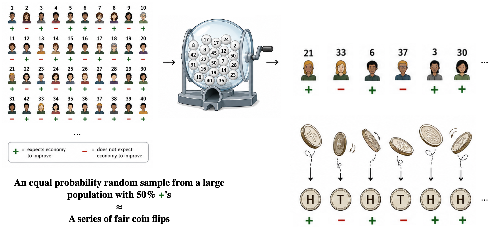
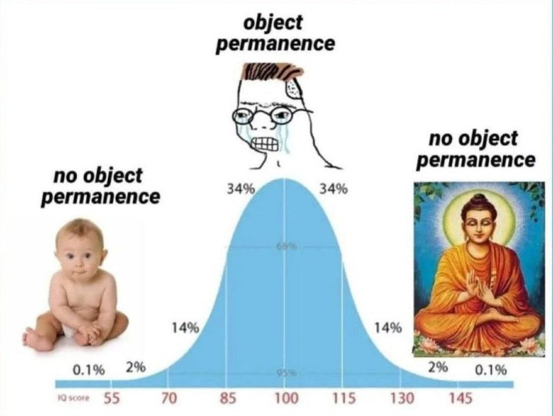

```{r}
#| label: setup
#| include: false
source("_setup.R")

lending_subs <- load_lending_subs()
austin <- load_austin_subset()
returns <- load_returns()
mincer <- load_mincer()
ercot_daily <- load_ercot_daily()

sb_rate <- mean(lending_subs$default[lending_subs$purpose == "small_business"])
dc_rate <- mean(lending_subs$default[lending_subs$purpose == "debt_consolidation"])

# Lognormal price model for the three-ZIP Austin subset (method of moments)
m <- mean(austin$latest_price)
v <- var(austin$latest_price)
sdlog <- sqrt(log(1 + v / m^2))
mulog <- log(m) - log(1 + v / m^2) / 2

# Small-business loan example: $10,000 principal, 60% recovery on default,
# default probability 0.25 (rounded from the data)
principal <- 10000
p_default <- 0.25
payoff_12 <- c(11200, 6000)   # 12% interest
payoff_16 <- c(11600, 6000)   # 16% interest
probs     <- c(1 - p_default, p_default)

ev_pay12 <- sum(probs * payoff_12)
ev_pay16 <- sum(probs * payoff_16)
sd_pay16 <- sqrt(sum(probs * (payoff_16 - ev_pay16)^2))

profit_A <- payoff_16 - principal
ev_A <- sum(probs * profit_A)
sd_A <- sqrt(sum(probs * (profit_A - ev_A)^2))

profit_B <- c(400, -3600)
probs_B  <- c(0.95, 0.05)
ev_B <- sum(probs_B * profit_B)
sd_B <- sqrt(sum(probs_B * (profit_B - ev_B)^2))

# Fitted normal model for weekly market returns
mu_r <- mean(returns$market)
sd_r <- sd(returns$market)
```

## You're funding one of two loans

Same amount, same terms, same borrower credit history --- only the purpose differs. The historical data:

```{r}
#| label: table-two-loan-defaults
lending_subs |>
  filter(purpose %in% c("small_business", "debt_consolidation")) |>
  group_by(purpose) |>
  summarise(n = n(), default_rate = mean(default)) |>
  arrange(desc(default_rate)) |>
  mutate(n = comma(n),
         default_rate = percent(default_rate, accuracy = 0.1)) |>
  rename(Purpose = purpose, Loans = n, `Default rate` = default_rate) |>
  knitr::kable(align = c("l", "r", "r"))
```

**Which loan would you fund, and what's the chance it defaults?**

## You did a number of things at once

::: {.incremental}
- You probably picked the debt consolidation loan and said there's a `r percent(dc_rate, accuracy = 0.1)` chance of default.
- You decided the historical data are *representative* of future outcomes.
- You constructed a rule for assigning probabilities to uncertain outcomes --- a **probability model** --- estimated its **parameters** (the two default probabilities), and used it to make a decision.
:::

## Probability describes data we don't have

::: {.incremental}
- Histograms, densities, ECDFs, and frequency tables describe distributions of **observed** data.
- In almost every example, we really want to know about data we *don't* have: the sale price of a new listing, the Fed funds rate after the next meeting, sentiment among all U.S. adults.
- A **probability distribution** assigns probabilities to all possible outcomes of a random or uncertain process --- it describes the distribution of future or unobserved data.
:::

## Sampling, two ways

::: {.incremental}
- Sampling from a **population**: a survey interviews 1,000 randomly chosen adults.
- Sampling from a **probability distribution**: flipping a coin 1,000 times generates realizations of a random process.
- If exactly half of adults expect the economy to improve, our 1,000 survey responses are, for all intents and purposes, 1,000 coin flips.
- Either way, the sample must represent what we're trying to learn about.
:::

## Survey responses as coin flips

{fig-align="center" height="500"}

# Probability basics

## Random variables

::: {.callout-note}
## Definition: Random variable

A **random variable** is a number about which we are uncertain --- incomplete information, or a future that hasn't happened. Written as capital letters: $X$, $Y$, $D$.
:::

::: {.incremental}
- $D$ = 1 if a new loan defaults, 0 if repaid.
- $X$ = the loan's payoff, in dollars.
- Uncertain categories become random variables by coding, just as observed categories did.
:::

## Events and probability

::: {.incremental}
- An **event** is a collection of possible outcomes: "the loan defaults" ($D = 1$), or "the payoff is at least \$10,000" ($X \geq 10{,}000$).
- A **probability** is a number in $[0, 1]$ attached to an event --- the higher the number, the more likely the event.
:::

## The three fundamental probability rules

::: {.incremental}
1. **Probabilities are non-negative.** $\Pr(A) \geq 0$.
2. **Something must happen.** $\Pr(\text{all possible outcomes}) = 1$.
3. **Mutually exclusive events add.** If $A$ and $B$ can't both happen, $\Pr(A \text{ or } B) = \Pr(A) + \Pr(B)$.
:::

::: {.fragment}
Everything else we do with probabilities follows from these three rules.
:::

## Two consequences worth knowing

The **complement rule**:

$$
\Pr(\text{not } A) = 1 - \Pr(A)
$$

::: {.fragment}
The **addition rule**, when events can overlap:

$$
\Pr(A \text{ or } B) = \Pr(A) + \Pr(B) - \Pr(A \text{ and } B)
$$

We subtract the overlap because it got counted twice.
:::

## Discrete and continuous random variables

::: {.incremental}
- A **discrete** random variable's outcomes fit in a list: $D$, $X$, counts.
- A **continuous** random variable can take any value in a range: prices, returns.
- This is not the same split as quantitative/categorical --- a count is quantitative but discrete.
:::

## The distribution of the default indicator

```{r}
#| label: table-default-pmf
tribble(
  ~Outcome, ~`Meaning`, ~Probability,
  "$D = 1$", "Loan defaults", "0.25",
  "$D = 0$", "Loan is repaid", "0.75"
) |>
  knitr::kable(align = c("l", "l", "r"))
```

::: {.fragment}
::: {.callout-note}
## Definition: Probability mass function

A **PMF** assigns a probability to each possible outcome of a discrete random variable. The probabilities are non-negative and sum to one --- like the proportion column of a frequency table, for a loan whose fate isn't known yet.
:::
:::

## The loan payoff distribution

A \$10,000 loan at 12% interest, with 60% of principal recovered in default:

```{r}
#| label: table-payoff-pmf
tribble(
  ~Outcome, ~`Meaning`, ~Probability,
  "$X = \\$11{,}200$", "Loan is repaid (principal + interest)", "0.75",
  "$X = \\$6{,}000$", "Loan defaults (60% of principal recovered)", "0.25"
) |>
  knitr::kable(align = c("l", "l", "r"))
```

Because the outcomes are now dollar amounts, we can ask what payoff the lender should *expect*.

## Example: where will the Fed's target range be?

[CME FedWatch](https://www.cmegroup.com/markets/interest-rates/cme-fedwatch-tool.html), July 9, 2026:

```{r}
#| label: table-cme-margins
full_join(
  cme_july |> rename(`July 29` = prob),
  cme_sept |> rename(`September 16` = prob),
  by = c("bucket", "midpoint")
) |>
  mutate(`July 29` = if_else(is.na(`July 29`), "---", number(`July 29`, accuracy = 0.001)),
         `September 16` = number(`September 16`, accuracy = 0.001),
         midpoint = percent(midpoint / 100, accuracy = 0.001)) |>
  rename(`Target range` = bucket, Midpoint = midpoint) |>
  knitr::kable(align = c("l", "r", "r", "r"))
```

The outcomes are target *ranges*; the midpoints stand in when we need numbers.

## The same distributions as bar charts

```{r}
#| label: viz-cme-pmfs
#| fig-width: 9
#| fig-height: 4
p_july <- ggplot(cme_july, aes(x = bucket, y = prob)) +
  geom_col(fill = "steelblue", width = 0.6) +
  geom_text(aes(label = number(prob, accuracy = 0.001)), vjust = -0.5, size = 4.2) +
  scale_y_continuous(limits = c(0, 0.85),
                     expand = expansion(mult = c(0, 0.05))) +
  labs(x = NULL, y = "Probability", title = "July 29 meeting") +
  theme_minimal(base_size = 13)

p_sept <- ggplot(cme_sept, aes(x = bucket, y = prob)) +
  geom_col(fill = "steelblue", width = 0.6) +
  geom_text(aes(label = number(prob, accuracy = 0.001)), vjust = -0.5, size = 4.2) +
  scale_y_continuous(limits = c(0, 0.85),
                     expand = expansion(mult = c(0, 0.05))) +
  labs(x = NULL, y = NULL, title = "September 16 meeting") +
  theme_minimal(base_size = 13)

p_july | p_sept
```

Heights are no longer shares of loans we counted, but chances for an outcome nobody has seen yet.

## Probability density functions

::: {.callout-note}
## Definition: Probability density function

A **PDF** assigns probabilities to **intervals** of a continuous random variable: the probability of an interval is the area under the curve over it. The curve is never negative, and the total area is one.
:::

::: {.incremental}
- The height of the curve is *not* a probability --- only areas are.
- Any single exact value has probability zero.
:::

## A price model for a future sale

```{r}
#| label: viz-price-model-density
#| fig-width: 9
#| fig-height: 4.2
dens_df <- tibble(x = seq(1e4, 2e6, length.out = 800),
                  y = dlnorm(x, meanlog = mulog, sdlog = sdlog))
p_interval <- plnorm(5e5, mulog, sdlog) - plnorm(4e5, mulog, sdlog)

ggplot(dens_df, aes(x = x, y = y)) +
  geom_area(data = filter(dens_df, x >= 4e5, x <= 5e5),
            fill = "darkorange", alpha = 0.8) +
  geom_line(color = "steelblue", linewidth = 1) +
  annotate("label", x = 9.5e5, y = max(dens_df$y) * 0.55,
           label = paste0("area = ", number(p_interval, accuracy = 0.01),
                          "\nPr($400K < X < $500K)"),
           size = 4.4, fill = "white", alpha = 0.9, label.size = 0.25) +
  scale_x_continuous(labels = dollar_format(scale = 1e-3, suffix = "K"),
                     limits = c(0, 2e6)) +
  labs(x = "Sale price", y = "Density")
```

Under this model, the next sale in our three Austin ZIP codes lands between \$400K and \$500K with probability `r number(p_interval, accuracy = 0.01)`.

## The cumulative distribution function

Plotting the accumulated area $\Pr(X \leq x)$ against $x$ gives the **CDF**.

```{r}
#| label: viz-price-model-cdf
#| fig-width: 9.5
#| fig-height: 4
x0 <- 5e5
p_below <- plnorm(x0, mulog, sdlog)

cdf_df <- tibble(x = dens_df$x, cdf = plnorm(x, mulog, sdlog))

p_dens <- ggplot(dens_df, aes(x = x, y = y)) +
  geom_area(data = filter(dens_df, x <= x0),
            fill = "darkorange", alpha = 0.8) +
  geom_line(color = "steelblue", linewidth = 1) +
  annotate("label", x = 1.05e6, y = max(dens_df$y) * 0.6,
           label = paste0("area = ", number(p_below, accuracy = 0.01)),
           size = 4.2, fill = "white", alpha = 0.9, label.size = 0.25) +
  scale_x_continuous(labels = dollar_format(scale = 1e-3, suffix = "K"),
                     limits = c(0, 2e6)) +
  labs(x = "Sale price", y = "Density") +
  theme_minimal(base_size = 12)

p_cdf <- ggplot(cdf_df, aes(x = x, y = cdf)) +
  geom_line(color = "steelblue", linewidth = 1) +
  annotate("point", x = x0, y = p_below, color = "darkorange", size = 3) +
  annotate("label", x = x0, y = p_below, parse = TRUE,
           label = paste0('Pr(X <= "$500K") == ', number(p_below, accuracy = 0.01)),
           hjust = -0.08, vjust = 1, size = 4.2,
           fill = "white", alpha = 0.9, label.size = 0.25) +
  scale_x_continuous(labels = dollar_format(scale = 1e-3, suffix = "K"),
                     limits = c(0, 2e6)) +
  scale_y_continuous(limits = c(0, 1)) +
  labs(x = "Sale price", y = "Cumulative probability") +
  theme_minimal(base_size = 12)

p_dens | p_cdf
```

The marked point on the right equals the shaded area on the left. The relationship runs both ways: the PDF is the derivative of the CDF --- the density is the rate at which cumulative probability accumulates.

## Tracing out the CDF

{fig-align="center"}

# Mean, variance, and other parameters

## What payoff should the lender expect?

The \$10,000 loan at 12% interest again:

```{r}
#| label: table-payoff-question
tribble(
  ~Outcome, ~Probability,
  "Repaid: $11,200", "0.75",
  "Default: $6,000", "0.25"
) |>
  knitr::kable(align = c("l", "r"))
```

## The mean of a random variable

::: {.callout-note}
## Definition: Mean (expected value) of a random variable

A weighted average of the possible outcomes, each weighted by its probability:

$$
E[X] = \sum_{i=1}^{k} \Pr(X = x_i)\,x_i
$$

We often write $\mu$: $E[X] = \mu$.
:::

The expected value is the long-run average outcome when the random process repeats many times. A fair coin ($X = 1$ for heads) has $E[X] = 0.5$. If you flip long enough, the average of your 0s and 1s will get arbitrarily close to 0.5.

## The expected payoff at 12%

```{r}
#| label: table-payoff-ev
tibble(
  Outcome = c("Repaid: $11,200", "Default: $6,000", "**Expected value**"),
  Probability = c("0.75", "0.25", ""),
  `Probability × outcome` = c(dollar(0.75 * 11200), dollar(0.25 * 6000),
                              dollar(sum(probs * payoff_12)))
) |>
  knitr::kable(align = c("l", "r", "r"))
```

Subtracting the \$10,000 principal gives an expected profit of `r dollar(ev_pay12 - principal)`: at 12% interest, this loan *loses* \$100 on average.

## Raising the rate to 16%

```{r}
#| label: table-payoff-ev-16
tibble(
  Outcome = c("Repaid: $11,600", "Default: $6,000", "**Expected value**"),
  Probability = c("0.75", "0.25", ""),
  `Probability × outcome` = c(dollar(0.75 * 11600), dollar(0.25 * 6000),
                              dollar(ev_pay16))
) |>
  knitr::kable(align = c("l", "r", "r"))
```

The expected profit flips to `r dollar(ev_A)` per loan. The expected value tells the lender which side of break-even the whole enterprise sits on.

## Example: the expected Fed rate {.smaller}

:::: {.columns}

::: {.column width="48%"}
**July 29 meeting**

```{r}
#| label: table-cme-params-july
cme_july |>
  mutate(midpoint = paste0(number(midpoint, accuracy = 0.001), "%"),
         prob = number(prob, accuracy = 0.001)) |>
  rename(`Target range` = bucket, Midpoint = midpoint, Probability = prob) |>
  knitr::kable(align = c("l", "r", "r"))
```
:::

::: {.column width="4%"}
:::

::: {.column width="48%"}
**September 16 meeting**

```{r}
#| label: table-cme-params-sept
cme_sept |>
  mutate(midpoint = paste0(number(midpoint, accuracy = 0.001), "%"),
         prob = number(prob, accuracy = 0.001)) |>
  rename(`Target range` = bucket, Midpoint = midpoint, Probability = prob) |>
  knitr::kable(align = c("l", "r", "r"))
```
:::

::::

Weighting midpoints by probabilities gives an implied expected target rate of `r number(sum(cme_july$midpoint * cme_july$prob), accuracy = 0.001)`% after July and `r number(sum(cme_sept$midpoint * cme_sept$prob), accuracy = 0.001)`% after September. Neither is a possible outcome --- the range moves in quarter-point steps.

## The median of a random variable

The median splits the probability in half: the smallest value where the cumulative probability reaches 0.50. For the price model, that's `r dollar(round(exp(mulog)))`.

```{r}
#| label: viz-price-median
#| fig-width: 9.5
#| fig-height: 4
med <- exp(mulog)

p_dens <- ggplot(dens_df, aes(x = x, y = y)) +
  geom_area(data = filter(dens_df, x <= med),
            fill = "darkorange", alpha = 0.8) +
  geom_line(color = "steelblue", linewidth = 1) +
  annotate("label", x = 1.05e6, y = max(dens_df$y) * 0.6,
           label = "area = 0.50",
           size = 4.2, fill = "white", alpha = 0.9, label.size = 0.25) +
  scale_x_continuous(labels = dollar_format(scale = 1e-3, suffix = "K"),
                     limits = c(0, 2e6)) +
  labs(x = "Sale price", y = "Density") +
  theme_minimal(base_size = 12)

p_cdf <- ggplot(cdf_df, aes(x = x, y = cdf)) +
  geom_segment(aes(x = 0, xend = med, y = 0.5, yend = 0.5),
               linetype = "dashed", color = "grey50") +
  geom_segment(aes(x = med, xend = med, y = 0, yend = 0.5),
               linetype = "dashed", color = "grey50") +
  geom_line(color = "steelblue", linewidth = 1) +
  annotate("point", x = med, y = 0.5, color = "darkorange", size = 3) +
  annotate("label", x = med, y = 0.5,
           label = paste0("median = ", dollar(round(med))),
           hjust = -0.08, vjust = 1, size = 4.2,
           fill = "white", alpha = 0.9, label.size = 0.25) +
  scale_x_continuous(labels = dollar_format(scale = 1e-3, suffix = "K"),
                     limits = c(0, 2e6)) +
  scale_y_continuous(limits = c(0, 1)) +
  labs(x = "Sale price", y = "Cumulative probability") +
  theme_minimal(base_size = 12)

p_dens | p_cdf
```

The model's mean price of `r dollar(round(m))` sits `r dollar(round(m - exp(mulog)))` above the median, pulled up by the long right tail just as in the observed data.

## Two loans, same expected profit {.smaller}

::: {.columns}

::: {.column width="48%"}
**Loan A (risky borrower, 16%)**

```{r}
#| label: table-loan-a-pmf
tibble(
  Profit = c(dollar(profit_A[1]), dollar(profit_A[2]), "**Expected profit**"),
  Probability = c(number(probs[1], accuracy = 0.01),
                  number(probs[2], accuracy = 0.01), ""),
  `Probability × profit` = c(dollar(probs[1] * profit_A[1]),
                             dollar(probs[2] * profit_A[2]),
                             dollar(ev_A))
) |>
  knitr::kable(align = c("l", "r", "r"))
```
:::

::: {.column width="4%"}
:::

::: {.column width="48%"}
**Loan B (safe borrower, 4%)**

```{r}
#| label: table-loan-b-pmf
tibble(
  Profit = c(dollar(profit_B[1]), dollar(profit_B[2]), "**Expected profit**"),
  Probability = c(number(probs_B[1], accuracy = 0.01),
                  number(probs_B[2], accuracy = 0.01), ""),
  `Probability × profit` = c(dollar(probs_B[1] * profit_B[1]),
                             dollar(probs_B[2] * profit_B[2]),
                             dollar(ev_B))
) |>
  knitr::kable(align = c("l", "r", "r"))
```
:::

:::

Both loans earn `r dollar(ev_B)` on average. **Which would you rather fund?**

## Variance and standard deviation

::: {.callout-note}
## Definition: Variance and standard deviation of a random variable

The probability-weighted average of squared deviations from the mean:

$$
\text{Var}(X) = \sum_{i=1}^{k} \Pr(X = x_i)\,(x_i - \mu)^2
$$

We write $\sigma^2 = \text{Var}(X)$. The **standard deviation** $\sigma = \sqrt{\text{Var}(X)}$ is back in the units of $X$.
:::

The variance is the expected squared distance between the random variable and its mean --- how wrong we expect to be if we predict $X$ by $\mu$.

## Standard deviation measures risk {.smaller}

In finance, the standard deviation of an uncertain payoff has a blunter name: **risk**.

```{r}
#| label: table-loan-risk
tibble(
  ` ` = c("Profit if repaid", "Profit if default", "Default probability",
          "Expected profit", "Standard deviation"),
  `Loan A (risky borrower, 16%)` = c(dollar(profit_A[1]), dollar(profit_A[2]),
                                     number(probs[2], accuracy = 0.01), dollar(ev_A), dollar(round(sd_A))),
  `Loan B (safe borrower, 4%)` = c(dollar(profit_B[1]), dollar(profit_B[2]),
                                   number(probs_B[2], accuracy = 0.01), dollar(ev_B), dollar(round(sd_B)))
) |>
  knitr::kable(align = c("l", "r", "r"))
```

The standard deviation responds to both of the things that make a gamble dangerous: how likely the bad outcome is, and how much is lost when it happens. Make Loan B for \$100,000 instead of \$10,000 and its standard deviation scales up tenfold, even though the default probability never moved.

## Two stocks with the same expected return

```{r}
#| label: viz-stock-risk
#| fig-width: 8
#| fig-height: 4
stock_grid <- tibble(x = seq(-30, 30, length.out = 400)) |>
  mutate(`Steady stock`   = dnorm(x, mean = 5, sd = 4),
         `Volatile stock` = dnorm(x, mean = 5, sd = 12)) |>
  pivot_longer(-x, names_to = "stock", values_to = "density")

ggplot(stock_grid, aes(x = x / 100, y = density, fill = stock, color = stock)) +
  geom_area(alpha = 0.25, position = "identity") +
  geom_vline(xintercept = 0.05, linetype = "dashed", color = "grey40") +
  scale_x_continuous(labels = percent_format(accuracy = 1)) +
  scale_fill_manual(values = c("Steady stock" = "steelblue",
                               "Volatile stock" = "darkorange")) +
  scale_color_manual(values = c("Steady stock" = "steelblue",
                                "Volatile stock" = "darkorange")) +
  labs(x = "Annual return", y = "Density", fill = NULL, color = NULL)
```

Riskier is not better or worse on average --- it is just riskier.

## Shifting and scaling

::: {.callout-note}
## Mean and standard deviation of $aX + b$

$$
E[aX + b] = a\,\mu + b, \qquad SD(aX + b) = |a|\,\sigma
$$
:::

::: {.incremental}
- Adding a constant shifts the center and leaves the spread alone --- shifting can't make an uncertain payoff more or less predictable.
- Multiplying by a constant scales both the center and the spread.
- One shift-and-scale earns its own name: $Z = \frac{X - \mu}{\sigma}$ is **standardization**, and it forces $E[Z] = 0$ and $SD(Z) = 1$ whatever distribution $X$ started with. A realized value of $Z$ is a **z-score**.
:::

## Continuous random variables

::: {.callout-note}
## Mean and variance of a continuous random variable

$$
E[X] = \int x \, f(x) \, dx, \qquad \text{Var}(X) = \int (x - \mu)^2 \, f(x) \, dx
$$
:::

Nothing about the meaning changes --- only the math, and we will let software handle it.

# The normal distribution

## The bell curve

{fig-align="center" height="500"}

## Two parameters govern the whole family

```{r}
#| label: viz-normal-params
#| fig-width: 8.5
#| fig-height: 4
norm_grid <- tibble(x = seq(-7, 7, length.out = 500)) |>
  mutate(`mean 0, variance 1` = dnorm(x, 0, 1),
         `mean 2, variance 1` = dnorm(x, 2, 1),
         `mean 0, variance 4` = dnorm(x, 0, 2)) |>
  pivot_longer(-x, names_to = "dist", values_to = "density") |>
  mutate(dist = factor(dist, levels = c("mean 0, variance 1",
                                        "mean 2, variance 1",
                                        "mean 0, variance 4")))

ggplot(norm_grid, aes(x = x, y = density, color = dist)) +
  geom_line(linewidth = 1) +
  scale_color_manual(values = c("mean 0, variance 1" = "steelblue",
                                "mean 2, variance 1" = "darkorange",
                                "mean 0, variance 4" = "darkgreen")) +
  labs(x = NULL, y = "Density", color = NULL) +
  theme(legend.position = "top")
```

Changing $\mu$ slides the curve without altering its shape; changing $\sigma^2$ stretches or squeezes it without moving the center. The distribution is symmetric, so its mean and median are equal.

## Notation

::: {.callout-note}
## Notation: the normal distribution

$$
X \sim N(\mu, \sigma^2)
$$

"$\sim$" reads "is distributed as." **The second parameter is the variance, not the standard deviation** --- though R's `pnorm` and `qnorm` ask for the standard deviation.
:::

A shifted and scaled normal random variable is still normal: $aX + b \sim N(a\mu + b,\; a^2\sigma^2)$.

## Modeling weekly market returns

Take next week's S&P 500 return $R$ and model it as normal, with the historical mean and standard deviation as parameters: $R \sim N(`r number(mu_r, accuracy = 0.0001)`, `r number(sd_r, accuracy = 0.0001)`^2)$.

```{r}
#| label: viz-returns-normal-model
#| fig-width: 8
#| fig-height: 4
ggplot(returns, aes(x = market)) +
  geom_histogram(aes(y = after_stat(density)),
                 bins = 20, fill = "steelblue", color = "white") +
  stat_function(fun = dnorm, args = list(mean = mu_r, sd = sd_r),
                color = "darkorange", linewidth = 1) +
  scale_x_continuous(labels = percent_format(accuracy = 1)) +
  labs(x = "Weekly return", y = "Density")
```

Weekly returns are not literally normal. The claim is that the normal is a *good enough approximation* in the region we care about --- and part of our job is checking that.

## Probabilities are areas

```{r}
#| label: viz-returns-normal-probs
#| fig-width: 10
#| fig-height: 5
norm_df <- tibble(x = seq(mu_r - 4 * sd_r, mu_r + 4 * sd_r, length.out = 500),
                  y = dnorm(x, mu_r, sd_r))

shade_panel <- function(lo, hi, title, prob, label_x = mu_r + 2.4 * sd_r) {
  ggplot(norm_df, aes(x = x, y = y)) +
    geom_area(data = filter(norm_df, x >= lo, x <= hi),
              fill = "darkorange", alpha = 0.8) +
    geom_line(color = "steelblue", linewidth = 0.9) +
    annotate("label", x = label_x, y = max(norm_df$y) * 0.82,
             label = paste0("area = ", number(prob, accuracy = 0.01)),
             size = 3.8, fill = "white", alpha = 0.9, label.size = 0.25) +
    scale_x_continuous(labels = percent_format(accuracy = 1)) +
    labs(x = NULL, y = NULL, title = title) +
    theme_minimal(base_size = 12)
}

p1 <- shade_panel(-Inf, 0,
                  paste0("Pr(R < 0) = ",
                         number(pnorm(0, mu_r, sd_r), accuracy = 0.01)),
                  pnorm(0, mu_r, sd_r))
p2 <- shade_panel(-Inf, -0.03,
                  paste0("Pr(R < -3%) = ",
                         number(pnorm(-0.03, mu_r, sd_r), accuracy = 0.01)),
                  pnorm(-0.03, mu_r, sd_r))
p3 <- shade_panel(-0.02, 0.02,
                  paste0("Pr(-2% < R < 2%) = ",
                         number(pnorm(0.02, mu_r, sd_r) - pnorm(-0.02, mu_r, sd_r),
                                accuracy = 0.01)),
                  pnorm(0.02, mu_r, sd_r) - pnorm(-0.02, mu_r, sd_r))
p4 <- shade_panel(0, Inf,
                  paste0("Pr(R >= 0) = ",
                         number(1 - pnorm(0, mu_r, sd_r), accuracy = 0.01)),
                  1 - pnorm(0, mu_r, sd_r),
                  label_x = mu_r - 2.4 * sd_r)

(p1 | p2) / (p3 | p4)
```

## Interval probabilities, two ways

```{r}
#| label: viz-interval-two-ways
#| fig-width: 10.5
#| fig-height: 5
shade <- function(lo, hi, title) {
  ggplot(norm_df, aes(x = x, y = y)) +
    geom_area(data = filter(norm_df, x >= lo, x <= hi),
              fill = "darkorange", alpha = 0.8) +
    geom_line(color = "steelblue", linewidth = 0.9) +
    scale_x_continuous(labels = percent_format(accuracy = 1)) +
    labs(x = NULL, y = NULL, title = title) +
    theme_minimal(base_size = 11)
}

pA <- shade(-Inf, 0.02,
            paste0("Pr(R < 2%) = ",
                   number(pnorm(0.02, mu_r, sd_r), accuracy = 0.01)))
pB <- shade(-Inf, -0.02,
            paste0("minus  Pr(R < -2%) = ",
                   number(pnorm(-0.02, mu_r, sd_r), accuracy = 0.01)))
pC <- shade(-0.02, 0.02,
            paste0("=  Pr(-2% < R < 2%) = ",
                   number(pnorm(0.02, mu_r, sd_r) - pnorm(-0.02, mu_r, sd_r),
                          accuracy = 0.01)))

pD <- shade(-Inf, Inf, "total area = 1")
pE <- ggplot(norm_df, aes(x = x, y = y)) +
  geom_area(data = filter(norm_df, x <= -0.02),
            fill = "darkorange", alpha = 0.8) +
  geom_area(data = filter(norm_df, x >= 0.02),
            fill = "darkorange", alpha = 0.8) +
  geom_line(color = "steelblue", linewidth = 0.9) +
  scale_x_continuous(labels = percent_format(accuracy = 1)) +
  labs(x = NULL, y = NULL,
       title = paste0("minus  two tails = ",
                      number(pnorm(-0.02, mu_r, sd_r) + 1 - pnorm(0.02, mu_r, sd_r),
                             accuracy = 0.01))) +
  theme_minimal(base_size = 11)
pF <- pC

(pA | pB | pC) / (pD | pE | pF)
```

The top row subtracts the left tail; the bottom row subtracts both tails from 1. Both routes leave the shaded middle.

## The 68/95/99.7 rule

::: {.callout-note}
## The 68/95/99.7 rule

If $X \sim N(\mu, \sigma^2)$, approximately

- **68%** of the probability lies within $\mu \pm \sigma$,
- **95%** within $\mu \pm 2\sigma$,
- **99.7%** within $\mu \pm 3\sigma$.
:::

A $-4\%$ week is a two-sigma event --- eyebrow-raising, not historic.

## The rule on the returns model

```{r}
#| label: viz-empirical-rule
#| fig-width: 8.5
#| fig-height: 4.4
band_df <- tibble(k = c(3, 2, 1),
                  lo = mu_r - k * sd_r, hi = mu_r + k * sd_r,
                  fill = c("#c6dbef", "#6baed6", "#2171b5"))

peak    <- dnorm(mu_r, mu_r, sd_r)
y68     <- peak * 0.35
y95     <- peak * 0.6
y997    <- peak * 0.9
bar_off <- 0.07 * peak
tick    <- 0.03 * peak

emp_bar <- function(k, ybar) {
  list(
    annotate("segment", x = mu_r - k * sd_r, xend = mu_r + k * sd_r,
             y = ybar, yend = ybar, color = "grey20"),
    annotate("segment", x = mu_r - k * sd_r, xend = mu_r - k * sd_r,
             y = ybar - tick / 2, yend = ybar + tick / 2, color = "grey20"),
    annotate("segment", x = mu_r + k * sd_r, xend = mu_r + k * sd_r,
             y = ybar - tick / 2, yend = ybar + tick / 2, color = "grey20")
  )
}

ggplot(norm_df, aes(x = x, y = y)) +
  geom_area(data = filter(norm_df, x >= band_df$lo[1], x <= band_df$hi[1]),
            fill = band_df$fill[1]) +
  geom_area(data = filter(norm_df, x >= band_df$lo[2], x <= band_df$hi[2]),
            fill = band_df$fill[2]) +
  geom_area(data = filter(norm_df, x >= band_df$lo[3], x <= band_df$hi[3]),
            fill = band_df$fill[3]) +
  geom_line(color = "grey30", linewidth = 0.9) +
  geom_vline(xintercept = mu_r, linetype = "dashed", color = "grey30") +
  emp_bar(1, y68 - bar_off) +
  emp_bar(2, y95 - bar_off) +
  emp_bar(3, y997 - bar_off) +
  annotate("label", x = mu_r, y = y68, label = "68%",
           size = 4.2, fill = "white", alpha = 0.9, label.size = 0.25) +
  annotate("label", x = mu_r, y = y95, label = "95%",
           size = 4, fill = "white", alpha = 0.9, label.size = 0.25) +
  annotate("label", x = mu_r, y = y997, label = "99.7%",
           size = 3.8, fill = "white", alpha = 0.9, label.size = 0.25) +
  annotate("label", x = mu_r, y = peak, label = "mu", parse = TRUE,
           size = 4, fill = "white", alpha = 0.9, label.size = 0.25) +
  scale_x_continuous(breaks = mu_r + c(-3, -2, -1, 0, 1, 2, 3) * sd_r,
                     labels = function(x) percent(x, accuracy = 0.1)) +
  labs(x = "Weekly return", y = "Density")
```

About two weeks in three land within one standard deviation of the mean, and about 19 in 20 within two.

## Z-scores, again

::: {.incremental}
- Standardizing a normal random variable gives the **standard normal**: $Z = \frac{X - \mu}{\sigma} \sim N(0, 1)$.
- A normal random variable lands more than 2 standard deviations out about 5% of the time, and more than 3 out about 0.3% of the time.
- In our `r nrow(returns)` weeks of data, `r sum(abs((returns$market - mu_r) / sd_r) > 2)` fall beyond two standard deviations --- right in line with the expected five. But `r sum(abs((returns$market - mu_r) / sd_r) > 3)` fall beyond three, where the model expects one week in roughly 370. Financial data deviate from the normal in the tails.
:::

## Normal distributions only!

::: {.callout-important}
## Normal distributions only!

Z-scores translate to probabilities *only when the underlying random variable is normal*. A z-score of 2.5 is a once-in-eighty event under a normal distribution; under a heavy-tailed one it might be a monthly occurrence.
:::

## QQ plots: checking normality

::: {.incremental}
- A **quantile-quantile (QQ) plot** plots the data's quantiles against the normal's.
- Data that are truly close to normal trace a straight line.
- Where the points bend tells you *how* the data deviate: a right tail peeling upward means values too large for a bell curve; an S-shape means skew.
:::

```{r}
#| label: qq-paired-helpers
#| include: false
z_returns <- (returns$market - mean(returns$market)) / sd(returns$market)

# Paired panels: observed histogram/density (top), theoretical normal (bottom),
# and the QQ plot being assembled one percentile at a time (right). Matches the
# construction animated in images/qq_animation.gif.
create_paired_plot <- function(z_scores, percentiles_to_show) {
  current_p <- percentiles_to_show[length(percentiles_to_show)]
  obs_val   <- quantile(z_scores, current_p)
  theor_val <- qnorm(current_p)

  p1a <- ggplot(tibble(x = z_scores), aes(x = x)) +
    geom_histogram(aes(y = after_stat(density)),
                   bins = 40, fill = "lightblue", color = "white") +
    geom_density(color = "darkblue", linewidth = 0.8) +
    geom_vline(xintercept = obs_val, color = "blue",
               linetype = "dashed", linewidth = 1) +
    geom_segment(x = theor_val, y = 0, xend = theor_val, yend = -0.05,
                 color = "purple", linewidth = 1.5) +
    labs(title = "Z-scored returns (observed)", x = NULL, y = "Density") +
    xlim(-4, 4) +
    theme_minimal(base_size = 12) +
    theme(axis.text.x = element_blank(), axis.ticks.x = element_blank())

  p1b <- ggplot(tibble(x = seq(-4, 4, length.out = 200)), aes(x = x)) +
    stat_function(fun = dnorm, color = "purple", linewidth = 1) +
    geom_vline(xintercept = theor_val, color = "purple",
               linetype = "dashed", linewidth = 1) +
    labs(x = paste0(round(current_p * 100, 1), "% of values below the line"),
         y = "Density", title = "Normal distribution (theoretical)") +
    xlim(-4, 4) +
    theme_minimal(base_size = 12)

  qq_points <- tibble(
    percentile  = percentiles_to_show,
    theoretical = qnorm(percentiles_to_show),
    observed    = quantile(z_scores, percentiles_to_show)
  ) |>
    mutate(is_current = percentile == current_p)

  p2 <- ggplot(qq_points, aes(x = theoretical, y = observed)) +
    geom_abline(slope = 1, intercept = 0, color = "gray50", linetype = "dashed") +
    geom_segment(x = theor_val, y = -4, xend = theor_val, yend = obs_val,
                 color = "purple", linetype = "dashed") +
    geom_segment(x = -4, y = obs_val, xend = theor_val, yend = obs_val,
                 color = "blue", linetype = "dashed") +
    geom_point(data = filter(qq_points, !is_current), color = "gray60", size = 3) +
    geom_point(data = filter(qq_points, is_current), color = "black", size = 3.5) +
    labs(title = "QQ plot", x = "Theoretical quantiles", y = "Observed quantiles") +
    coord_fixed(ratio = 1, xlim = c(-4, 4), ylim = c(-4, 4)) +
    theme_minimal(base_size = 12)

  (p1a / p1b) | p2
}
```

## Comparing distributions percentile by percentile {.smaller}

One way to compare two distributions is to ask whether they share the same percentiles: half of a standard normal falls below 0, so we check whether half of the z-scored returns do too.

```{r}
#| label: viz-qq-build-1
#| fig-width: 10
#| fig-height: 4.2
create_paired_plot(z_returns, 0.50)
```

Blue marks the median of the returns, purple the median of the normal; the pair is the first point on the QQ plot.

## The 75th percentile adds a point

```{r}
#| label: viz-qq-build-2
#| fig-width: 10
#| fig-height: 4.4
create_paired_plot(z_returns, c(0.50, 0.75))
```

Blue and purple now mark the 75th percentile of each distribution, giving a second point.

## The 10th percentile adds another

```{r}
#| label: viz-qq-build-3
#| fig-width: 10
#| fig-height: 4.4
create_paired_plot(z_returns, c(0.50, 0.75, 0.10))
```

Blue and purple mark the 10th percentile; each comparison we make lands one more point.

## Every percentile becomes a point

{fig-align="center"}

Sweeping from the 1st percentile to the 99th traces the whole curve --- close to the 45-degree line here, except at the extremes.

```{r}
#| label: qq-helpers
#| include: false
qq_panel <- function(x, title) {
  z <- (x - mean(x)) / sd(x)
  tibble(z = z) |>
    ggplot(aes(sample = z)) +
    stat_qq_line(color = "darkorange", linewidth = 0.8) +
    stat_qq(color = "steelblue", alpha = 0.4, size = 0.8) +
    labs(x = "Normal quantiles", y = "Observed quantiles (z-scores)",
         title = title) +
    theme_minimal(base_size = 12)
}

z_hist <- function(x) {
  z <- (x - mean(x)) / sd(x)
  tibble(z = z) |>
    ggplot(aes(x = z)) +
    geom_histogram(aes(y = after_stat(density)), bins = 30,
                   fill = "steelblue", color = "white") +
    stat_function(fun = dnorm, args = list(mean = 0, sd = 1),
                  color = "darkorange", linewidth = 0.9) +
    labs(x = "z-score", y = "Density") +
    theme_minimal(base_size = 12)
}

set.seed(7)
wage_sample <- sample(mincer$hrly_wage, 5000)
```

## QQ plot: weekly market returns

```{r}
#| label: viz-qq-returns
#| fig-width: 9.5
#| fig-height: 4.2
qq_panel(returns$market, "Weekly S&P 500 returns") | z_hist(returns$market)
```

The returns track the line closely, with the smallest and largest weeks pulling slightly away --- the same mildly heavy tails our z-score check found.

## QQ plot: hourly wages

```{r}
#| label: viz-qq-wages
#| fig-width: 9.5
#| fig-height: 4.2
qq_panel(wage_sample, "Hourly wages") | z_hist(wage_sample)
```

Wages bow high above the line at the top: extreme earners are far larger than any normal distribution would produce. That is the QQ signature of strong right skew.

## QQ plot: log hourly wages

```{r}
#| label: viz-qq-logwages
#| fig-width: 9.5
#| fig-height: 4.2
qq_panel(log(wage_sample), "Log hourly wages") | z_hist(log(wage_sample))
```

Taking logs pulls the wage points dramatically closer to the line, though the tails are still a little heavier than a normal distribution expects.

## QQ plot: daily electricity demand

```{r}
#| label: viz-qq-ercot
#| fig-width: 9.5
#| fig-height: 4.2
qq_panel(ercot_daily$load, "Daily electricity demand (DFW)") |
  z_hist(ercot_daily$load)
```

The systematic bends indicate lighter-than-normal tails, and crossing the reference line can signal a second mode or a shoulder --- not consistent with a normal distribution.

## Even normal data wobbles

```{r}
#| label: viz-qq-reference
#| fig-width: 9.5
#| fig-height: 4.8
set.seed(11)
ref_panel <- function(title) {
  x <- rnorm(nrow(returns))
  z <- (x - mean(x)) / sd(x)
  tibble(z = z) |>
    ggplot(aes(sample = z)) +
    stat_qq_line(color = "darkorange", linewidth = 0.8) +
    stat_qq(color = "steelblue", alpha = 0.4, size = 0.8) +
    labs(x = "Normal quantiles", y = "Observed quantiles (z-scores)",
         title = title) +
    theme_minimal(base_size = 11)
}

(ref_panel("Sample 1") | ref_panel("Sample 2") | ref_panel("Sample 3")) /
  (ref_panel("Sample 4") | ref_panel("Sample 5") | ref_panel("Sample 6"))
```

Six simulated datasets of the same size as the returns data (n = `r nrow(returns)`), each drawn exactly from a normal distribution. Deviations of this size are noise, not evidence; sustained departures from the line are what's suspicious.
