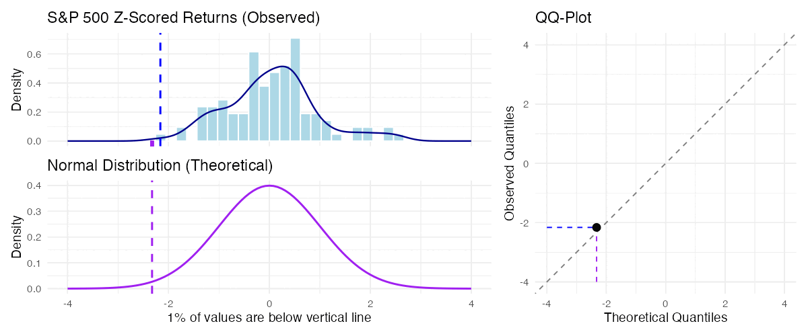

```{r}
#| label: setup
#| include: false
source("_setup.R")

returns <- load_returns()
mincer <- load_mincer()
ercot_daily <- load_ercot_daily()

# Fitted normal model for weekly market returns
mu_r <- mean(returns$market)
sd_r <- sd(returns$market)
```

## Normal distributions have two parameters

```{r}
#| label: viz-normal-params
#| fig-width: 8.5
#| fig-height: 4
norm_grid <- tibble(x = seq(-7, 7, length.out = 500)) |>
  mutate(`mean 0, variance 1` = dnorm(x, 0, 1),
         `mean 2, variance 1` = dnorm(x, 2, 1),
         `mean 0, variance 4` = dnorm(x, 0, 2)) |>
  pivot_longer(-x, names_to = "dist", values_to = "density") |>
  mutate(dist = factor(dist, levels = c("mean 0, variance 1",
                                        "mean 2, variance 1",
                                        "mean 0, variance 4")))

ggplot(norm_grid, aes(x = x, y = density, color = dist)) +
  geom_line(linewidth = 1) +
  scale_color_manual(values = c("mean 0, variance 1" = "steelblue",
                                "mean 2, variance 1" = "darkorange",
                                "mean 0, variance 4" = "darkgreen")) +
  labs(x = NULL, y = "Density", color = NULL) +
  theme(legend.position = "top")
```

Changing $\mu$ slides the curve without altering its shape; changing $\sigma^2$ stretches or squeezes it without moving the center. The distribution is symmetric, so its mean and median are equal.

## Notation

::: {.callout-note}
## Notation: the normal distribution

$$
X \sim N(\mu, \sigma^2)
$$

"$\sim$" reads "is distributed as." **The second parameter is the variance, not the standard deviation** --- though R's `pnorm` and `qnorm` ask for the standard deviation.
:::

A shifted and scaled normal random variable is still normal: $aX + b \sim N(a\mu + b,\; a^2\sigma^2)$.

::: {.fragment}
**Quick check:** If $X\sim N(500,80^2)$, identify its mean, variance, and standard deviation. Which two values would you give software that asks for the mean and standard deviation?
:::

## Modeling weekly market returns

We model next week's S&P 500 return $R$ as normal, using the historical mean and standard deviation as parameters. The fitted model is $R \sim N(`r number(mu_r, accuracy = 0.0001)`, `r number(sd_r, accuracy = 0.0001)`^2)$.

```{r}
#| label: viz-returns-normal-model
#| fig-width: 8
#| fig-height: 4
ggplot(returns, aes(x = market)) +
  geom_histogram(aes(y = after_stat(density)),
                 bins = 20, fill = "steelblue", color = "white") +
  stat_function(fun = dnorm, args = list(mean = mu_r, sd = sd_r),
                color = "darkorange", linewidth = 1) +
  scale_x_continuous(labels = percent_format(accuracy = 1)) +
  labs(x = "Weekly return", y = "Density")
```

Weekly returns are not literally normal. We use the normal distribution as an approximation in the region we care about, and we check that approximation against the data below.

## Probabilities are areas

```{r}
#| label: viz-returns-normal-probs
#| fig-width: 10
#| fig-height: 5
norm_df <- tibble(x = seq(mu_r - 4 * sd_r, mu_r + 4 * sd_r, length.out = 500),
                  y = dnorm(x, mu_r, sd_r))

shade_panel <- function(lo, hi, title, prob, label_x = mu_r + 2.4 * sd_r) {
  ggplot(norm_df, aes(x = x, y = y)) +
    geom_area(data = filter(norm_df, x >= lo, x <= hi),
              fill = "darkorange", alpha = 0.8) +
    geom_line(color = "steelblue", linewidth = 0.9) +
    annotate("label", x = label_x, y = max(norm_df$y) * 0.82,
             label = paste0("area = ", number(prob, accuracy = 0.01)),
             size = 3.8, fill = "white", alpha = 0.9, label.size = 0.25) +
    scale_x_continuous(labels = percent_format(accuracy = 1)) +
    labs(x = NULL, y = NULL, title = title) +
    theme_minimal(base_size = 12)
}

p1 <- shade_panel(-Inf, 0,
                  paste0("Pr(R < 0) = ",
                         number(pnorm(0, mu_r, sd_r), accuracy = 0.01)),
                  pnorm(0, mu_r, sd_r))
p2 <- shade_panel(-Inf, -0.03,
                  paste0("Pr(R < -3%) = ",
                         number(pnorm(-0.03, mu_r, sd_r), accuracy = 0.01)),
                  pnorm(-0.03, mu_r, sd_r))
p3 <- shade_panel(-0.015, 0.015,
                  paste0("Pr(-1.5% < R < 1.5%) = ",
                         number(pnorm(0.015, mu_r, sd_r) - pnorm(-0.015, mu_r, sd_r),
                                accuracy = 0.01)),
                  pnorm(0.015, mu_r, sd_r) - pnorm(-0.015, mu_r, sd_r))
p4 <- shade_panel(0, Inf,
                  paste0("Pr(R >= 0) = ",
                         number(1 - pnorm(0, mu_r, sd_r), accuracy = 0.01)),
                  1 - pnorm(0, mu_r, sd_r),
                  label_x = mu_r - 2.4 * sd_r)

(p1 | p2) / (p3 | p4)
```

## Interval probabilities, two ways

```{r}
#| label: viz-interval-two-ways
#| fig-width: 10.5
#| fig-height: 5
shade <- function(lo, hi, title) {
  ggplot(norm_df, aes(x = x, y = y)) +
    geom_area(data = filter(norm_df, x >= lo, x <= hi),
              fill = "darkorange", alpha = 0.8) +
    geom_line(color = "steelblue", linewidth = 0.9) +
    scale_x_continuous(labels = percent_format(accuracy = 1)) +
    labs(x = NULL, y = NULL, title = title) +
    theme_minimal(base_size = 11)
}

pA <- shade(-Inf, 0.015,
            paste0("Pr(R < 1.5%) = ",
                   number(pnorm(0.015, mu_r, sd_r), accuracy = 0.01)))
pB <- shade(-Inf, -0.015,
            paste0("minus  Pr(R < -1.5%) = ",
                   number(pnorm(-0.015, mu_r, sd_r), accuracy = 0.01)))
pC <- shade(-0.015, 0.015,
            paste0("=  Pr(-1.5% < R < 1.5%) = ",
                   number(pnorm(0.015, mu_r, sd_r) - pnorm(-0.015, mu_r, sd_r),
                          accuracy = 0.01)))

pD <- shade(-Inf, Inf, "total area = 1")
pE <- ggplot(norm_df, aes(x = x, y = y)) +
  geom_area(data = filter(norm_df, x <= -0.015),
            fill = "darkorange", alpha = 0.8) +
  geom_area(data = filter(norm_df, x >= 0.015),
            fill = "darkorange", alpha = 0.8) +
  geom_line(color = "steelblue", linewidth = 0.9) +
  scale_x_continuous(labels = percent_format(accuracy = 1)) +
  labs(x = NULL, y = NULL,
       title = paste0("minus  two tails = ",
                      number(pnorm(-0.015, mu_r, sd_r) + 1 - pnorm(0.015, mu_r, sd_r),
                             accuracy = 0.01))) +
  theme_minimal(base_size = 11)
pF <- pC

(pA | pB | pC) / (pD | pE | pF)
```

The top row subtracts the left tail. The bottom row subtracts both outside tails from 1. Both calculations give the same interval probability.

## Service-time probabilities

A logistics team models delivery time as $T\sim N(42,9^2)$ minutes. Sketch the areas for $\Pr(T>60)$ and $\Pr(35<T<50)$, then write each calculation using $F_T$.

:::: {.r-stack}
::: {.fragment .fade-out data-fragment-index="1"}
```{r}
#| label: viz-service-probabilities-prompt
#| fig-width: 9.5
#| fig-height: 3.8
service_df <- tibble(
  x = seq(6, 78, length.out = 600),
  y = dnorm(x, mean = 42, sd = 9)
)

service_base <- function() {
  ggplot(service_df, aes(x = x, y = y)) +
    geom_line(color = "steelblue", linewidth = 1) +
    scale_x_continuous(breaks = seq(15, 75, 15)) +
    labs(x = "Delivery time (minutes)", y = NULL) +
    theme_minimal(base_size = 12)
}

p_service_right <- service_base() +
  geom_vline(xintercept = 60, color = "darkorange", linetype = "dashed") +
  labs(title = "More than 60 minutes")

p_service_middle <- service_base() +
  geom_vline(xintercept = c(35, 50), color = "darkorange",
             linetype = "dashed") +
  labs(title = "Between 35 and 50 minutes")

p_service_right | p_service_middle
```
:::

::: {.fragment .fade-in data-fragment-index="1"}
```{r}
#| label: viz-service-probabilities-solution
#| fig-width: 9.5
#| fig-height: 3.8
p_service_right_solution <- service_base() +
  geom_area(data = filter(service_df, x > 60),
            fill = "darkorange", alpha = 0.8) +
  geom_line(color = "steelblue", linewidth = 1) +
  labs(title = expression(1 - F[T](60) == 0.0228))

p_service_middle_solution <- service_base() +
  geom_area(data = filter(service_df, x > 35, x < 50),
            fill = "darkorange", alpha = 0.8) +
  geom_line(color = "steelblue", linewidth = 1) +
  labs(title = expression(F[T](50) - F[T](35) == 0.5946))

p_service_right_solution | p_service_middle_solution
```
:::
::::

## The 68/95/99.7 rule

::: {.callout-note}
## The 68/95/99.7 rule

If $X \sim N(\mu, \sigma^2)$, approximately

- **68%** of the probability lies within $\mu \pm \sigma$.
- Approximately **95%** lies within $\mu \pm 2\sigma$.
- Approximately **99.7%** lies within $\mu \pm 3\sigma$.
:::

Under this model, a $-4\%$ week is 2.11 standard deviations below the mean. Its lower-tail probability is 0.017, or about once per 58 weeks.

## The rule on the returns model

```{r}
#| label: viz-empirical-rule
#| fig-width: 8.5
#| fig-height: 4.4
band_df <- tibble(k = c(3, 2, 1),
                  lo = mu_r - k * sd_r, hi = mu_r + k * sd_r,
                  fill = c("#c6dbef", "#6baed6", "#2171b5"))

peak    <- dnorm(mu_r, mu_r, sd_r)
y68     <- peak * 0.35
y95     <- peak * 0.6
y997    <- peak * 0.9
bar_off <- 0.07 * peak
tick    <- 0.03 * peak

emp_bar <- function(k, ybar) {
  list(
    annotate("segment", x = mu_r - k * sd_r, xend = mu_r + k * sd_r,
             y = ybar, yend = ybar, color = "grey20"),
    annotate("segment", x = mu_r - k * sd_r, xend = mu_r - k * sd_r,
             y = ybar - tick / 2, yend = ybar + tick / 2, color = "grey20"),
    annotate("segment", x = mu_r + k * sd_r, xend = mu_r + k * sd_r,
             y = ybar - tick / 2, yend = ybar + tick / 2, color = "grey20")
  )
}

ggplot(norm_df, aes(x = x, y = y)) +
  geom_area(data = filter(norm_df, x >= band_df$lo[1], x <= band_df$hi[1]),
            fill = band_df$fill[1]) +
  geom_area(data = filter(norm_df, x >= band_df$lo[2], x <= band_df$hi[2]),
            fill = band_df$fill[2]) +
  geom_area(data = filter(norm_df, x >= band_df$lo[3], x <= band_df$hi[3]),
            fill = band_df$fill[3]) +
  geom_line(color = "grey30", linewidth = 0.9) +
  geom_vline(xintercept = mu_r, linetype = "dashed", color = "grey30") +
  emp_bar(1, y68 - bar_off) +
  emp_bar(2, y95 - bar_off) +
  emp_bar(3, y997 - bar_off) +
  annotate("label", x = mu_r, y = y68, label = "68%",
           size = 4.2, fill = "white", alpha = 0.9, label.size = 0.25) +
  annotate("label", x = mu_r, y = y95, label = "95%",
           size = 4, fill = "white", alpha = 0.9, label.size = 0.25) +
  annotate("label", x = mu_r, y = y997, label = "99.7%",
           size = 3.8, fill = "white", alpha = 0.9, label.size = 0.25) +
  annotate("label", x = mu_r, y = peak, label = "mu", parse = TRUE,
           size = 4, fill = "white", alpha = 0.9, label.size = 0.25) +
  scale_x_continuous(breaks = mu_r + c(-3, -2, -1, 0, 1, 2, 3) * sd_r,
                     labels = function(x) percent(x, accuracy = 0.1)) +
  labs(x = "Weekly return", y = "Density")
```

About two weeks in three land within one standard deviation of the mean, and about 19 in 20 within two.

## Z-scores, again

::: {.incremental}
- Standardizing a normal random variable gives the **standard normal**: $Z = \frac{X - \mu}{\sigma} \sim N(0, 1)$.
- A normal random variable lands more than 2 standard deviations out about 5% of the time, and more than 3 out about 0.3% of the time.
- In our `r nrow(returns)` weeks of data, `r sum(abs((returns$market - mu_r) / sd_r) > 2)` fall beyond two standard deviations, where the model expects about five. We observe `r sum(abs((returns$market - mu_r) / sd_r) > 3)` beyond three standard deviations, where the model expects about 0.3. Both counts are consistent with sampling variation in a sample this small.
:::

## Z-scores and normal probabilities

::: {.callout-important}
## Z-scores and normal probabilities

A z-score translates to probabilities *only when the underlying random variable is normal*. Under a normal model, $|Z| \geq 2.5$ occurs about once in 80 observations; under a heavy-tailed model it can occur much more often.
:::

## What a z-score does and does not tell us {.smaller}

A strongly right-skewed measure of engineering productivity has mean 420 and standard deviation 500. One engineer's observed value is 1,420.

1. Calculate and interpret the z-score.
2. Can a normal table or normal-distribution software determine the probability of a value at least this large?

::: {.fragment}
$$
z=\frac{1{,}420-420}{500}=2.
$$

The observation is two standard deviations above the mean. That interpretation is valid for any distribution, but the strongly right-skewed shape does not justify a normal tail probability.
:::

## QQ plots: checking normality

::: {.incremental}
- A **quantile-quantile (QQ) plot** plots observed quantiles against the corresponding theoretical normal quantiles.
- Data that are truly close to normal trace a straight line.
- Where the points bend away from the line tells us how the data differ from a normal distribution. The examples below show the common patterns.
:::

```{r}
#| label: qq-paired-helpers
#| include: false
z_returns <- (returns$market - mean(returns$market)) / sd(returns$market)

# Paired panels: observed histogram/density (top), theoretical normal (bottom),
# and the QQ plot being assembled one percentile at a time (right). Matches the
# construction animated in images/qq_animation.gif.
create_paired_plot <- function(z_scores, percentiles_to_show) {
  current_p <- percentiles_to_show[length(percentiles_to_show)]
  obs_val   <- quantile(z_scores, current_p)
  theor_val <- qnorm(current_p)

  p1a <- ggplot(tibble(x = z_scores), aes(x = x)) +
    geom_histogram(aes(y = after_stat(density)),
                   bins = 40, fill = "lightblue", color = "white") +
    geom_density(color = "darkblue", linewidth = 0.8) +
    geom_vline(xintercept = obs_val, color = "blue",
               linetype = "dashed", linewidth = 1) +
    geom_segment(x = theor_val, y = 0, xend = theor_val, yend = -0.05,
                 color = "purple", linewidth = 1.5) +
    labs(title = "Z-scored returns (observed)", x = NULL, y = "Density") +
    xlim(-4, 4) +
    theme_minimal(base_size = 12) +
    theme(axis.text.x = element_blank(), axis.ticks.x = element_blank())

  p1b <- ggplot(tibble(x = seq(-4, 4, length.out = 200)), aes(x = x)) +
    stat_function(fun = dnorm, color = "purple", linewidth = 1) +
    geom_vline(xintercept = theor_val, color = "purple",
               linetype = "dashed", linewidth = 1) +
    labs(x = paste0(round(current_p * 100, 1), "% of values below the line"),
         y = "Density", title = "Normal distribution (theoretical)") +
    xlim(-4, 4) +
    theme_minimal(base_size = 12)

  qq_points <- tibble(
    percentile  = percentiles_to_show,
    theoretical = qnorm(percentiles_to_show),
    observed    = quantile(z_scores, percentiles_to_show)
  ) |>
    mutate(is_current = percentile == current_p)

  p2 <- ggplot(qq_points, aes(x = theoretical, y = observed)) +
    geom_abline(slope = 1, intercept = 0, color = "gray50", linetype = "dashed") +
    geom_segment(x = theor_val, y = -4, xend = theor_val, yend = obs_val,
                 color = "purple", linetype = "dashed") +
    geom_segment(x = -4, y = obs_val, xend = theor_val, yend = obs_val,
                 color = "blue", linetype = "dashed") +
    geom_point(data = filter(qq_points, !is_current), color = "gray60", size = 3) +
    geom_point(data = filter(qq_points, is_current), color = "black", size = 3.5) +
    labs(title = "QQ plot", x = "Theoretical quantiles", y = "Observed quantiles") +
    coord_fixed(ratio = 1, xlim = c(-4, 4), ylim = c(-4, 4)) +
    theme_minimal(base_size = 12)

  (p1a / p1b) | p2
}
```

## Comparing distributions percentile by percentile {.smaller}

One way to compare two distributions is to ask whether they share the same percentiles. Half of a standard normal falls below 0, so we check whether half of the z-scored returns do too.

```{r}
#| label: viz-qq-build-1
#| fig-width: 10
#| fig-height: 4.2
create_paired_plot(z_returns, 0.50)
```

Blue marks the median of the returns, purple the median of the normal; the pair is the first point on the QQ plot.

## The 75th percentile adds a point

```{r}
#| label: viz-qq-build-2
#| fig-width: 10
#| fig-height: 4.4
create_paired_plot(z_returns, c(0.50, 0.75))
```

Blue and purple now mark the 75th percentile of each distribution, giving a second point.

## The 10th percentile adds another

```{r}
#| label: viz-qq-build-3
#| fig-width: 10
#| fig-height: 4.4
create_paired_plot(z_returns, c(0.50, 0.75, 0.10))
```

Blue and purple mark the 10th percentile; each comparison we make lands one more point.

## Every percentile becomes a point

{fig-align="center"}

Sweeping from the 1st percentile to the 99th traces the whole curve --- close to the reference line here, except at the extremes.

## Even normal data wobbles

```{r}
#| label: viz-qq-reference
#| fig-width: 9.5
#| fig-height: 4.8
set.seed(11)
ref_panel <- function(title) {
  x <- rnorm(nrow(returns))
  z <- (x - mean(x)) / sd(x)
  tibble(z = z) |>
    ggplot(aes(sample = z)) +
    geom_abline(slope = 1, intercept = 0, color = "darkorange", linewidth = 0.8) +
    stat_qq(color = "steelblue", alpha = 0.4, size = 0.8) +
    labs(x = "Normal quantiles", y = "Observed quantiles (z-scores)",
         title = title) +
    theme_minimal(base_size = 11)
}

(ref_panel("Sample 1") | ref_panel("Sample 2") | ref_panel("Sample 3")) /
  (ref_panel("Sample 4") | ref_panel("Sample 5") | ref_panel("Sample 6"))
```

These six simulated datasets have the same size as the returns data (n = `r nrow(returns)`) and come from a normal distribution. Deviations of this size are consistent with sampling variation. Sustained departures from the line provide evidence against normality.

```{r}
#| label: qq-helpers
#| include: false
qq_panel <- function(x, title) {
  z <- (x - mean(x)) / sd(x)
  tibble(z = z) |>
    ggplot(aes(sample = z)) +
    geom_abline(slope = 1, intercept = 0, color = "darkorange", linewidth = 0.8) +
    stat_qq(color = "steelblue", alpha = 0.4, size = 0.8) +
    labs(x = "Normal quantiles", y = "Observed quantiles (z-scores)",
         title = title) +
    theme_minimal(base_size = 12)
}

z_hist <- function(x) {
  z <- (x - mean(x)) / sd(x)
  tibble(z = z) |>
    ggplot(aes(x = z)) +
    geom_histogram(aes(y = after_stat(density)), bins = 30,
                   fill = "steelblue", color = "white") +
    stat_function(fun = dnorm, args = list(mean = 0, sd = 1),
                  color = "darkorange", linewidth = 0.9) +
    labs(x = "z-score", y = "Density") +
    theme_minimal(base_size = 12)
}

set.seed(7)
wage_sample <- sample(mincer$hrly_wage, 5000)
```

## QQ plot: weekly market returns

```{r}
#| label: viz-qq-returns
#| fig-width: 9.5
#| fig-height: 4.2
qq_panel(returns$market, "Weekly S&P 500 returns") | z_hist(returns$market)
```

The returns track the line closely. With only 104 weeks, the tail departures are too small to distinguish from ordinary sampling variation.

## QQ plot: hourly wages

```{r}
#| label: viz-qq-wages
#| fig-width: 9.5
#| fig-height: 4.2
qq_panel(wage_sample, "Hourly wages") | z_hist(wage_sample)
```

At the top of the plot, observed wages lie well above the corresponding normal quantiles. The sustained upward departure indicates strong right skew; the flat run at the very top comes from capped reported earnings.

## QQ plot: log hourly wages

```{r}
#| label: viz-qq-logwages
#| fig-width: 9.5
#| fig-height: 4.2
qq_panel(log(wage_sample), "Log hourly wages") | z_hist(log(wage_sample))
```

Taking logs pulls the wage points much closer to the line, though the tails remain somewhat heavier than a normal distribution expects.

## QQ plot: daily electricity demand

```{r}
#| label: viz-qq-ercot
#| fig-width: 9.5
#| fig-height: 4.2
qq_panel(ercot_daily$load, "Daily electricity demand (DFW)") |
  z_hist(ercot_daily$load)
```

The points flatten at both ends because the observed extremes are less extreme than a normal distribution predicts. The flat stretch through the middle indicates that many days have similar loads, producing a shoulder in the distribution.
